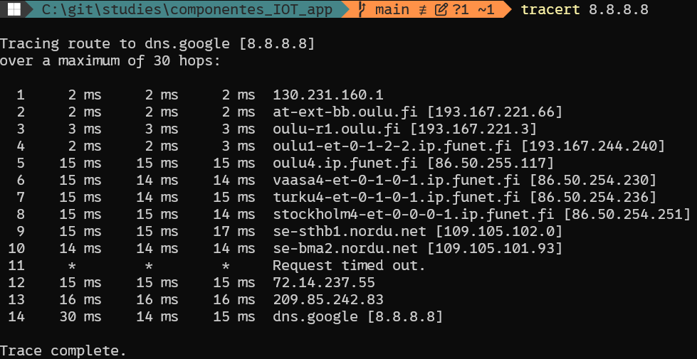
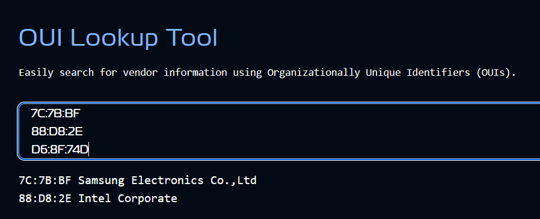
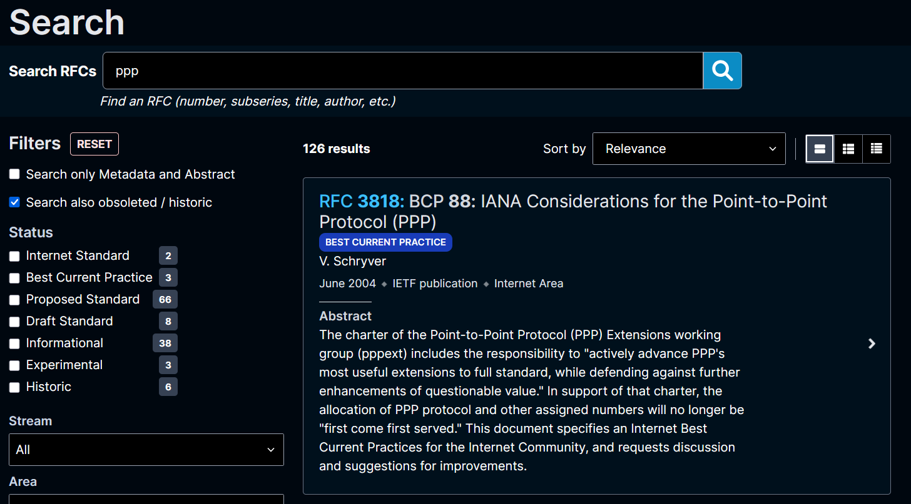
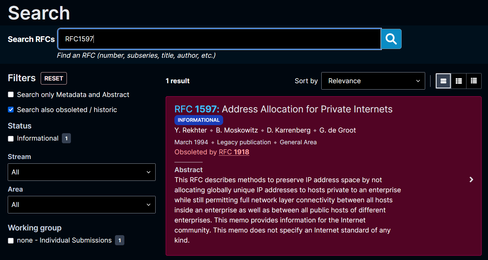
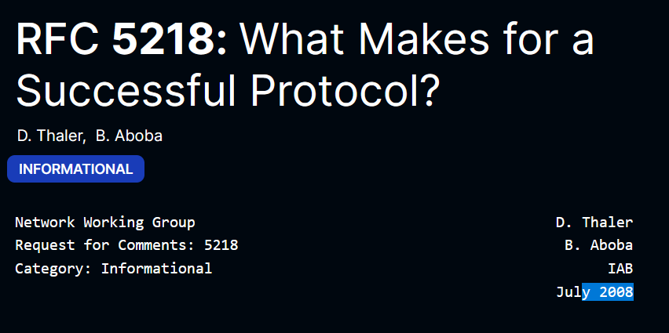
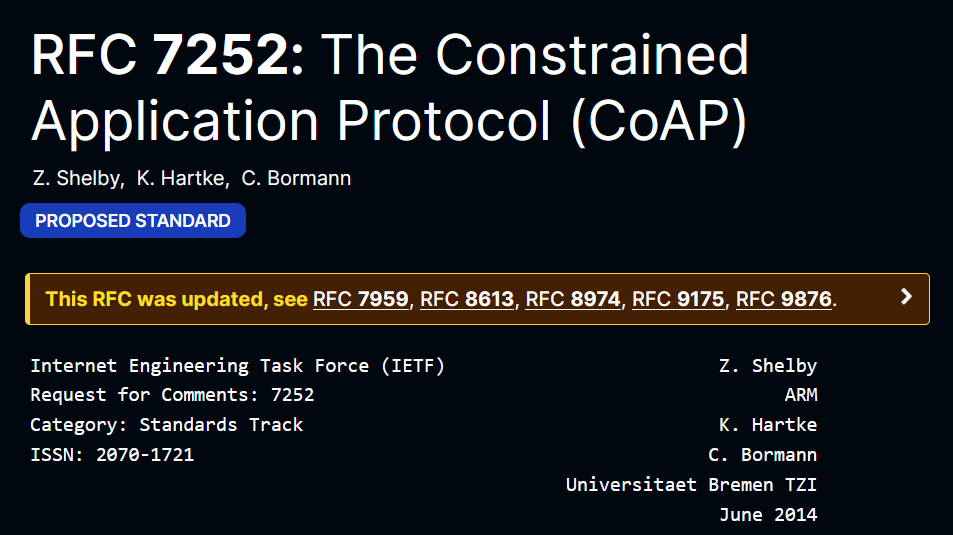
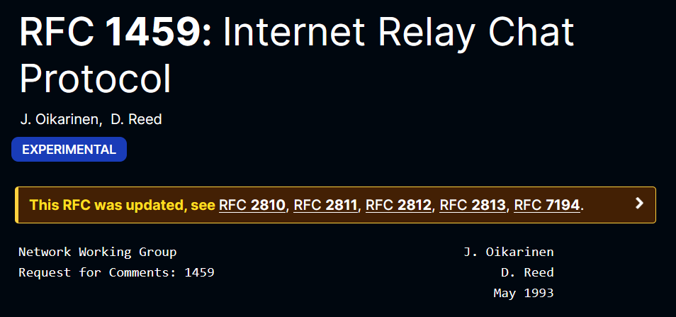
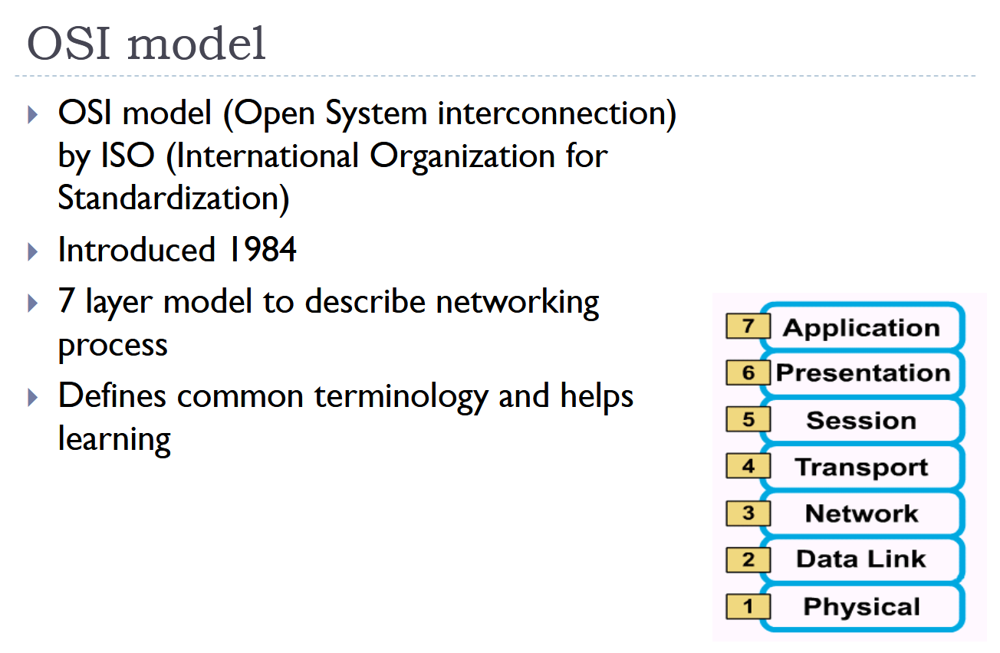
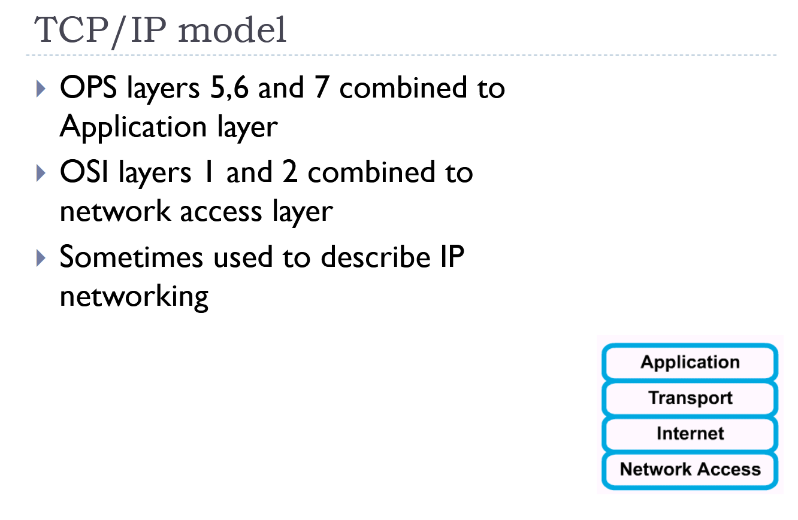
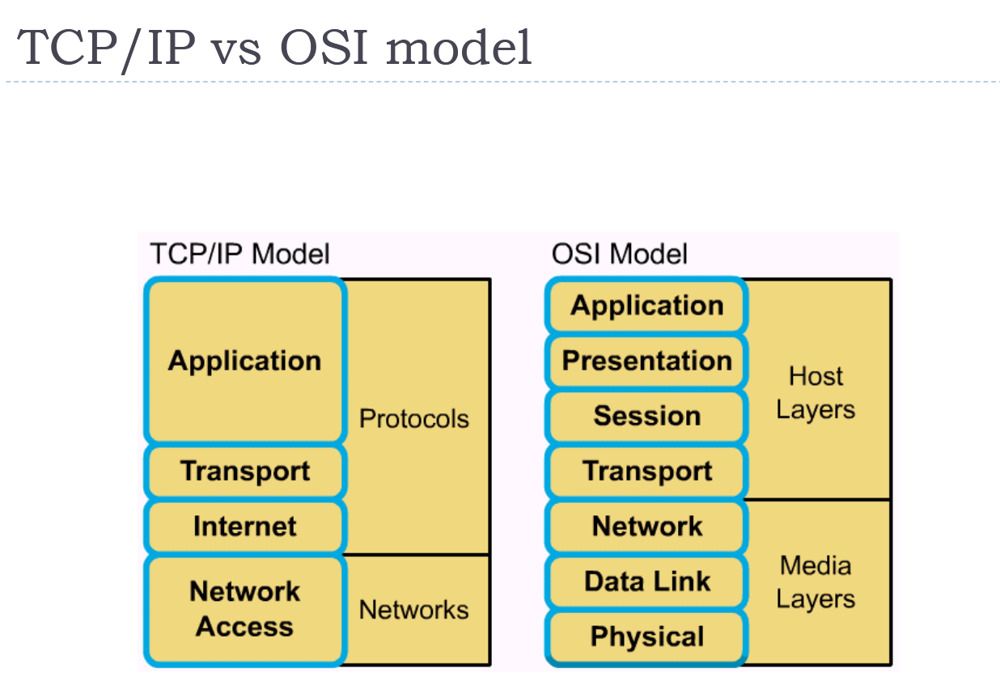

# Components of IoT Application

Gleb Bulygin<br>gbulygin@students.oamk.fi<br>DIN24SP<br>Autumn 2026

---

## Week 1

### 1. **Define foundational networking terms.** Write 2–3 sentences for each term. State what it means, why it matters, and, where useful, give one concrete example or relationship to another term.

### Performance and protocol data:

- **network bandwidth** — a parameter that shows how much data can be transmitted.
  - Ever-growing need
  - Limited availability
  - Smart design and usage saves money
  - One important factor to estimate is "how good" the network actually is
- **network throughput** — Actual data successfully delivered over the link
- **packet loss and jitter** — during the data transmission, packets can be lost. It can be referred to as **_packet loss_**. Even a packet loss rate of 5% can severely reduce effective throughput, depending on the network conditions and communication protocol. <br> **_Jitter_** describes the variation in packet delay or round-trip time (RTT). High jitter can lead to interruptions and reduced performance in communication protocols, especially for real-time applications.
- **bps versus Bps**: **_bps_** — bits per second (b/s), **_Bps_** — byte per second (B/s). 1 Bps = 8 bps.

  

  _fig 1.1 — Hobbit/hobbyte joke._<br> _Credit to unknown reddit user_

- **protocol payload** —
- **protocol overhead, especially in resource-constrained IoT systems** —

### Link layer, topology, media, and wireless networking:

- **Spanning Tree Protocol (STP)** — A Layer 2 protocol that prevents switching loops in Ethernet networks by blocking redundant paths. If an active link fails, a blocked path can be activated.
- **collision domain** — A network segment where devices share the same transmission medium and simultaneous transmissions can cause collisions. Switches reduce collision domains by giving each port its own domain.
- **broadcast domain** — A group of devices that receive the same Layer 2 broadcast traffic. Routers separate broadcast domains.
- **SOHO network** — A Small Office/Home Office network designed for a small number of users and devices. It typically consists of a router, Wi-Fi access point, and computers.
- **MAC (physical) address** — A unique Layer 2 hardware address assigned to a network interface. It is used to identify devices within a local network.
- **physical-layer protocol data unit (PDU)** — The PDU of the Physical Layer is a bit. The Physical Layer transmits raw bits over the transmission medium.
- **MAC-layer protocol data unit (PDU)** — The PDU of the Data Link (MAC) Layer is a frame. Frames contain MAC addresses and the encapsulated network-layer data.
- **half-duplex versus full-duplex** — Half-duplex communication allows sending or receiving, but not both at the same time. Full-duplex communication allows simultaneous transmission and reception.
- **Ethernet auto-negotiation** — A process where Ethernet devices automatically determine the highest compatible speed and duplex mode. This occurs when a connection is established.
- **hidden-node problem in wireless networking** — In wireless networks, two devices may be unable to hear each other but can both communicate with an access point. This can lead to collisions and reduced performance.
- **physical versus logical network topology** — Physical topology describes how devices are physically connected by cables or wireless links. Logical topology describes how data flows between devices.
- **TIA/EIA-568 and ISO/IEC 11801** — These are cabling standards that define requirements for structured network cabling, including wiring schemes, performance categories, and installation practices.
- **Ethernet cabling categories, for example Category 6** — Ethernet categories define cable performance characteristics such as bandwidth and supported data rates. Higher categories generally support higher speeds and frequencies. **Cat6** specs: max frequency: 250MHz, typical speed 1Gbps up to 100m, supports 10 Gbps for shorter distances (about 55m)
- **8P8C connector, often informally called RJ45** — An 8-position, 8-contact connector commonly used for Ethernet cables. Although often called RJ45, the technically correct term is 8P8C.
- **Wi-Fi ad hoc mode** — A wireless networking mode where devices communicate directly with each other without an access point. It creates a peer-to-peer network.
- **IEEE 802.11ac, 802.11ax, and 802.11be.** — These are Wi-Fi standards corresponding to Wi-Fi 5, Wi-Fi 6/6E, and Wi‑Fi 7 respectively. Each generation improves speed, efficiency, and support for multiple devices.

### Tracking the data path

In In Windows we can track the connection with `tracert` command. Following shows path from my laptop connected to `Eduroam` network to Google public DNS server. It goes from the local network (everything with a small delay) to Vaasa - Turku - Stockholm

```pwsh
tracert 8.8.8.8
```



fig 1.2 — Result of `tracert` command.

### 2. Estimate how long does it take to download 3 TB file from cloud based backup service if network download throughput is 200 Mbps for actual payload (i.e. data)?

```
file_size = 3 TB = 3,000 GB = 3,000,000 MB = 24,000,000 Mb
download_speed = 200 Mbs
download_time = file_size/download_speed = 24,000,000 / 200 s = 120,000 s
1 h = 3600 s
download_time_hours = 33.33 h
```

### 3. Locate the MAC address of your mobile phone, laptop wifi interface or some other networked IT device

I have checked MAC addresses of my laptop using following command:

```
# on Windows
ipconfig /all
```

On my phone I have checked the MAC address from the Wi-Fi settings.

I also verified my findings from my Wi-Fi router's control panel (DHCP Clients List). There you can see all devices currently connected to the network, their `Client name`, `Mac Address`, `Assigned IP`, and `Lease time`. To my surprise, the MAC address of my phone was different from the one I found in the settings. Apparently, it does some MAC randomization.

I won't add a screenshot for privacy reasons, but here are masked MAC addresses of my devices:

- Laptop: 88:D8:2E:00:00:00
- Phone:
  - 7C:7B:BF:00:00:00- actual address from phone settings
  - D6:8F:74:00:00:00 - from the router

Using [this](https://www.wireshark.org/tools/oui-lookup.html) tool I have searched for OUI of my devices. Laptop showed as `Intel Corporate`, actual phone address `Samsung Electronics Co., Ltd`, and the random address that my phone actually used to connect to the router had no matches in this database.



fig 1.3 — QUI Lookup tool

### 4. Describe shortly what are these network devices, functions, and services:

- **Repeater** — Receives a signal and retransmits it to extend the communication distance.
- **Hub (multiport repeater)** — Connects multiple devices and forwards incoming data to all ports, regardless of the destination.
- **Bridge** — Connects two network segments and forwards traffic only when necessary based on MAC addresses.
- **Access switch** — Connects end devices such as PCs, printers, and access points to the local network.
- **Core switch** — A high-performance switch that interconnects access switches and carries large amounts of network traffic.
- **Edge router** — Connects an organization's network to external networks, such as the Internet.
- **Core router** — Routes traffic between major networks within a service provider or large enterprise backbone.
- **Firewall** — Monitors and filters network traffic according to security rules to block unauthorized access.
- **Wifi AP** — Provides wireless network access and connects Wi‑Fi devices to the wired network.
- **WLAN AP controller** — Centrally manages multiple wireless access points, including configuration, security, and roaming.
- **Network TAP** — A monitoring device that copies network traffic for analysis without affecting the original traffic flow.

### 5. RFC assignments

**What are RFCs?**

**_RFCs_ (Request for Comments)** are technical documents that describe how Internet technologies, protocols, procedures, and standards work. They are published by organizations such as the **Internet Engineering Task Force (IETF)** and serve as the official reference for many Internet standards.

Historically, RFCs started as informal documents shared among researchers working on the early ARPANET. Despite the name, many RFCs today are official Internet standards.

**How many PPP related RFC documents can you find from rfc-editor website?**



fig 1.4 — Search results for `ppp` on [https://www.rfc-editor.org](https://www.rfc-editor.org) has **126** results.

**What is the current status of RFC1597? What is the number for updated, more recent RFC of same topic?**



fig 1.5 — RFC 1597 is **Obsoleted by RFC 1918**

**When was RFC5218 released?**



fig 1.6 — RFC 5218 was released in July 2008

**What is the meaning if RFC status is BCP?**

**_BCP_** stands for Best Current Practice.

An RFC with status BCP is not necessarily a protocol standard. Instead, it documents the recommended way to do something on the Internet based on operational experience and community consensus.

**List authors of the CoAP RFC (June 2014). What is the RFC number?**



fig 1.7 — RFC 7252: The Constrained Application Protocol (CoAP)

Authors:

- Z. Shelby
- K. Hartke
- C. Bormann

**Twitch.tv provides IRC access to the stream chats. Which RFC defines the original Internet Relay Chat (IRC) Protocol?**



fig 1.8 — RFC 1459. This is the earliest RFC I found on IRC.

### 6. What is OSI model? Compare OSI model to TCP/IP model



fig 1.9 — OSI model slide

The **_OSI (Open Systems Interconnection)_** model is a conceptual framework that describes how data travels through a network. It divides network communication into seven layers, each with specific responsibilities.



fig 1.10 — TCP/IP model slide



fig 1.11 — TCP/IP vs OSI model
