# Components of IoT Application

Gleb Bulygin<br>gbulygin@students.oamk.fi<br>DIN24SP<br>Autumn 2026

---

## Week 2

### 7. What are VLANs and IEEE 802.1q?

A **_VLAN (Virtual LAN)_** divides a physical network into separate logical networks, allowing different groups of devices to communicate as if they were on separate switches. Each VLAN typically has its own IP subnet, which improves security, reduces broadcast traffic, and simplifies network management. Devices in different VLANs cannot communicate directly without a router or Layer 3 switch.

**_IEEE 802.1Q_** is the standard that adds VLAN tags to Ethernet frames, allowing multiple VLANs to share the same network link between switches.

### 8. Define following terms and concepts shortly:

- **ARP (Address Resolution Protocol)** maps an IPv4 address to a MAC address on a local network so Ethernet frames can be delivered to the correct device.

- **ARP Spoofing** — a network attack where a device sends fake ARP messages to associate its MAC address with another device's IP address, allowing traffic interception or redirection.

- **Hop (Networking)** — a single step a packet takes through a router on its journey from source to destination. Each router crossed counts as one hop.

- **IP TTL (Time To Live)** is a field in an IP packet that limits how many hops it can traverse. Each router decreases the TTL by 1; when it reaches 0, the packet is discarded.

- **IP TOS (DSCP)** — Type of Service (TOS), now commonly implemented as **_DSCP (Differentiated Services Code Point)_**, is used to prioritize network traffic such as voice, video, or normal data.

- **DHCP and DHCP Relay**

  **_DHCP (Dynamic Host Configuration Protocol)_**: Automatically assigns IP addresses and other network settings to devices.

  **DHCP Relay**: Forwards DHCP requests between clients and a DHCP server located on a different network or VLAN.

- **WoL (Wake-on-LAN)** — feature that allows a computer to be powered on remotely by sending a specially crafted "magic packet" over the network.

- **UPnP (Universal Plug and Play)** — a protocol that lets applications automatically create port forwarding rules on a router, simplifying connectivity for games and applications.

- **Traceroute / Tracepath** — Network diagnostic tools that show the path packets take to a destination by identifying the routers (hops) along the route.

- **Network Address Translation (NAT)** — a technique where a router translates private IP addresses to one or more public IP addresses, allowing multiple devices to share an Internet connection.

- **Tier 1 and Tier 2 Networks**
  - Tier 1: Large global networks that can reach all other networks without paying for transit.

  - Tier 2: Networks that peer with some networks but also purchase transit from other providers.

- **Tier 3 ISP** — local or regional Internet Service Provider that mainly provides end-user connectivity and purchases Internet transit from higher-tier providers.

- **Autonomous System (AS / ASN)** — a collection of networks under a single administrative organization that presents a common routing policy on the Internet. Each AS is identified by an ASN (Autonomous System Number) and participates in BGP routing.

- **127.0.0.1 Address** — the IPv4 loopback address, representing the local computer itself. Traffic sent to this address never leaves the device.

- **::1 Address** — the IPv6 equivalent of 127.0.0.1, used as the loopback address for the local device.

- **0.0.0.0/0 and ::/0 in Routing Tables**
  - **0.0.0.0/0** — default route for IPv4.
  - **::/0** — default route for IPv6.

  Packets destined for unknown networks are sent via the default route.

- **IPv4 Multicast and Experimental Address Ranges**

  Multicast: 224.0.0.0/4 (224.0.0.0 - 239.255.255.255), used for one-to-many communication.

  Experimental / Reserved: 240.0.0.0/4 (240.0.0.0 - 255.255.255.254), reserved for future or experimental use and generally not routed on the public Internet.

### 9. Search some information about AS1741

> Data sourced from [https://stat.ripe.net](https://stat.ripe.net), [https://bgp.he.net/](https://bgp.he.net/)

- Which organisation or company advertises AS1741 with BGP?
  - **_FUNETAS CSC - Tieteen tietotekniikan keskus Oy_**
- List some public peering exchange points the AS1741 connects to?
  - FICIX (Helsinki, 193.110.224.14, 2001:7f8:7:b::1741:1)
  - FICIX Espoo (Espoo, 193.110.226.14, 2001:7f8:7:a::1741:1)
  - FICIX Oulu (Oulu, 193.110.225.14, 2001:7f8:7:c::1741:1)
  - TREX (Tampere, 195.140.192.17, 2001:7f8:1d:4::6cd:1)
- To which regional internet registry (RIR) the AS1741 belongs to?
  - **_RIPE NCC_** (Fig 2.1)
  - Country: **_Finland_**
- What is the contact email address/phone/web form if you would need to inform some security or abuse issues to the owner of the AS1741?
  - Email: cert@cert.funet.fi
  - [https://www.funet.fi](https://www.funet.fi)

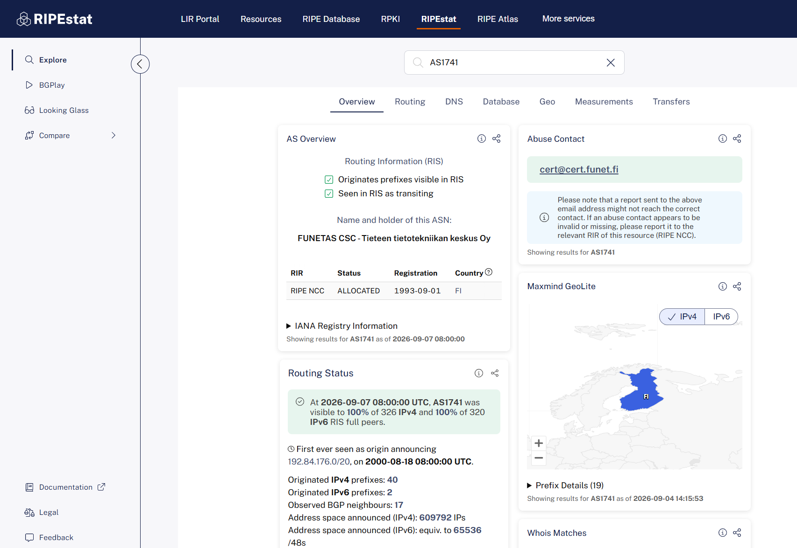

**_Figure 2.1_** — Search result on [https://stat.ripe.net](https://stat.ripe.net)

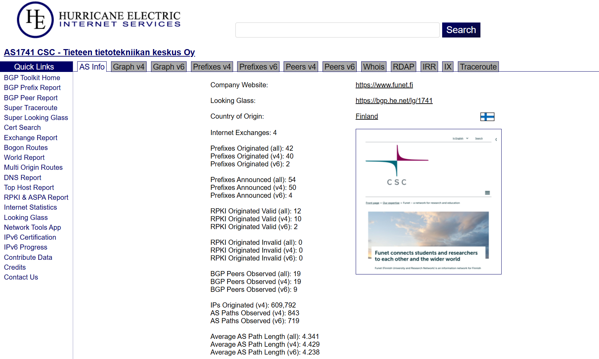

**_Figure 2.2_** — Search result on [https://bgp.he.net/](https://bgp.he.net/)

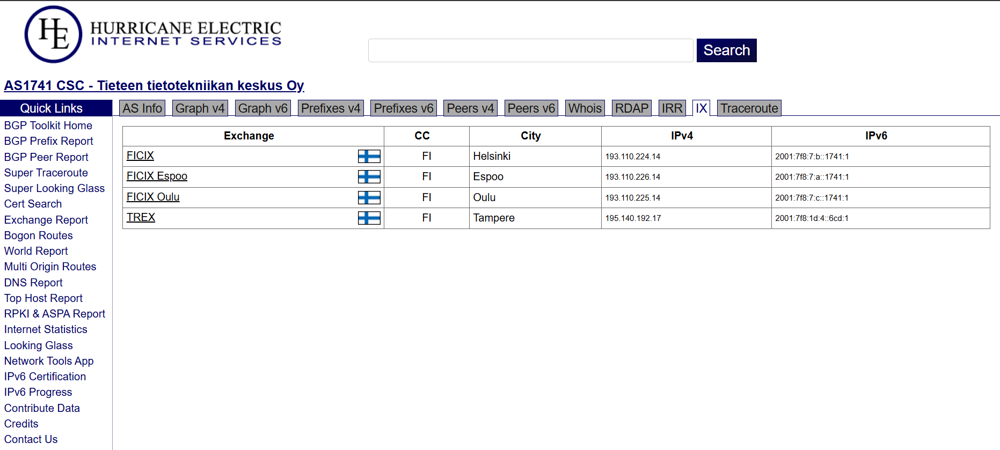
**_Figure 2.3_** — Exchange points

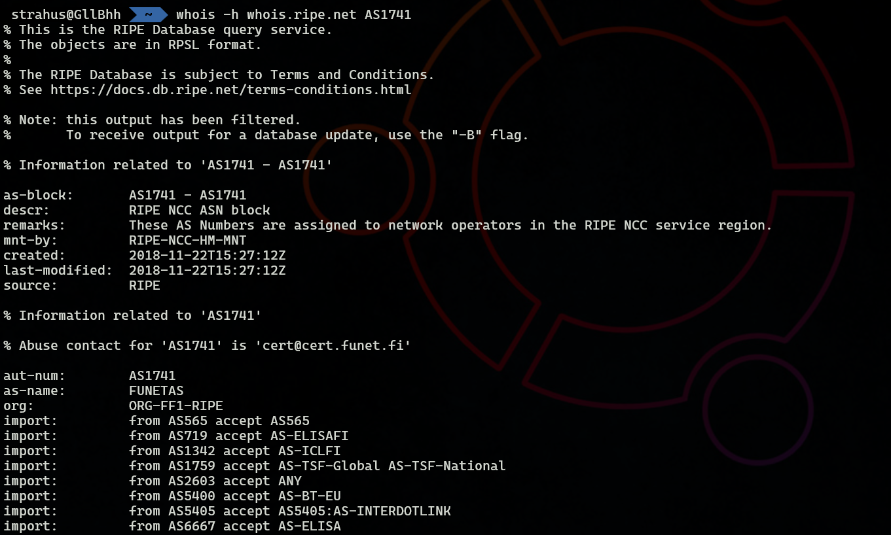
**_Figure 2.4_** — `whois -h whois.ripe.net AS1741` command output

### 10. What it the difference between static and dynamic routing? Use example(s)

> Apparently, I misunderstood the question slightly at the beginning. I've kept the section about static and dynamic IP addresses because it is still relevant to the topic, but the first part of the answer has been updated to better address the original question.

### Static vs Dynamic Routing

Quite often there is no need for dynamic routing.

Even relatively large organizations may have only a few routers, for example:

- One router connecting all internal subnets
- One firewall connecting the organization to the Internet

In such a network, only a few static routes may be required.

Example

On the router connected to all local networks:

- Configure a default route (0.0.0.0/0) pointing to the firewall.

On the firewall:

- Forward Internet-bound traffic to the Internet Service Provider (ISP).
- Forward traffic destined for internal networks back to the internal router.

In this type of network, static routing is simple, easy to manage, and introduces very little overhead.

**When is Dynamic Routing Needed?**

Dynamic routing becomes useful when the network topology changes frequently.

Examples include:

Large enterprise networks
Networks with multiple interconnected routers
Networks with redundant links
Data centers
Wireless mesh networks
Large IoT deployments where devices or routing paths may change

Dynamic routing protocols automatically learn routes and can adapt when links or routers fail.

Examples of dynamic routing protocols:

- RIP (Routing Information Protocol)
- OSPF (Open Shortest Path First)
- EIGRP
- IS-IS
- BGP (Border Gateway Protocol)

A major disadvantage of static routing is that routes do not adapt automatically to network failures.

For example:

```
Router A ---- Router B ---- Router C
```

If the link between Router B and Router C fails:

Traffic will continue to be sent toward Router B.
The packets will not reach their destination.
Connectivity will be lost until the route is manually changed or a backup route has been configured.

Dynamic routing protocols can automatically detect such failures and select alternative paths.

**Routing Metrics**

When multiple paths exist, routers use routing metrics to determine the best route.

Common metrics include:

- Bandwidth
- Delay (latency)
- Hop count
- Reliability
- Cost
- Hop Count

Hop count measures the number of routers a packet must pass through.

Example:

```
Path A: 3 hops
Path B: 5 hops
```

Using only hop count, Path A would be selected.

However, fewer hops do not necessarily mean better performance. A shorter path may contain a slow or congested link.

**Bandwidth**
Bandwidth is often a better metric because it reflects the capacity of a link.

Example:

```
Path A: 3 hops, 10 Mbps
Path B: 5 hops, 1 Gbps
```

Although Path B has more hops, it may provide significantly better throughput.

**RIP and OSPF**

**RIP (Routing Information Protocol)**
Uses hop count as its metric.
The route with the fewest hops is preferred.
Simple to configure.
Suitable for small networks.
Maximum path length is 15 hops.

**OSPF (Open Shortest Path First)**
Uses a cost metric based primarily on bandwidth.
Faster convergence than RIP.
Better suited for medium and large networks.
Can select higher-bandwidth paths even when they contain more hops.

---

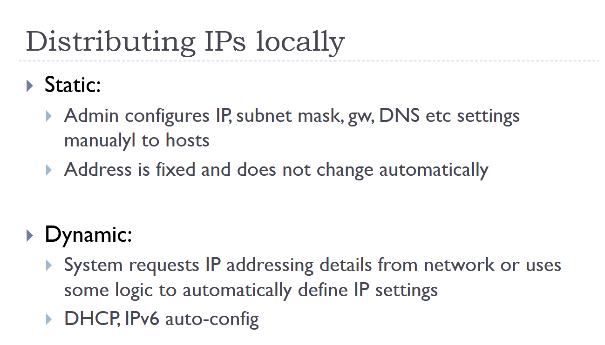
**_Figure 2.5_** — Static vs dynamic slide

With static IP configuration, a network administrator manually sets the network parameters for each device, such as the IP address, subnet mask, default gateway, and DNS servers. On Windows, these settings can be viewed and modified from `Control Panel → Network and Sharing Center → Change adapter settings`.

With dynamic IP configuration, a device automatically receives its network settings from a DHCP server, which is often integrated into a router. This allows network settings to be distributed automatically to many devices, reducing administrative effort. It is common to configure a DHCP reservation, where a specific MAC address is always assigned the same IP address. As a result, even if a device has been offline for some time, it will usually receive the same IP address when it reconnects to the network.

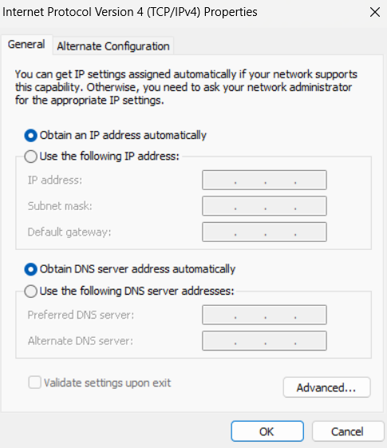

**_Figure 2.6_** — My IPv4 settings

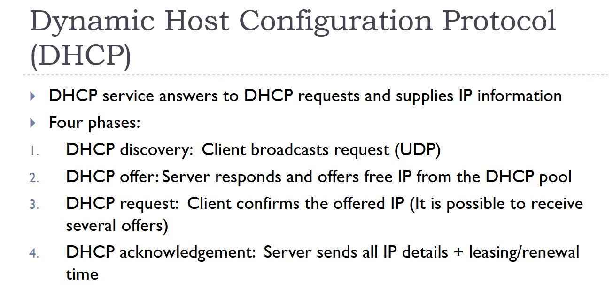

**_Figure 2.7_** — DHCP explained

### 11. Describe briefly these dynamic routing protocols:

- **RIP (Routing Information Protocol)** is a simple distance-vector routing protocol that selects routes based on the number of hops (routers) to the destination. The maximum path length is 15 hops, which limits RIP to small networks. Routers periodically exchange their routing tables with neighbors.
- **OSPF (Open Shortest Path First) and IS-IS (Intermediate System to Intermediate System)** are link-state routing protocols commonly used in large enterprise and ISP networks.
  - Routers build a map of the network topology.
  - They calculate the shortest path using the Shortest Path First (SPF) algorithm.
  - They adapt quickly to network changes.
  - OSPF is more common in enterprise networks, while IS-IS is often used by large service providers and carrier networks.
- **BGP (Border Gateway Protocol)** is the routing protocol that connects Autonomous Systems (ASes) on the Internet. Unlike RIP or OSPF, BGP focuses on routing policies and AS paths rather than shortest paths. It allows ISPs, universities, and large organizations to exchange routing information globally.

  **Example**:

  ```
  CSC (AS1741)
        |
      BGP
        |
      ISP
        |
     Internet
  ```

  **BGP** is often called the routing protocol of the Internet.

- **RPL (Routing Protocol for Low-Power and Lossy Networks)** is designed for IoT (Internet of Things) and sensor networks where devices have limited power, memory, and bandwidth. It organizes devices into a topology called a DODAG (Destination-Oriented Directed Acyclic Graph) and chooses routes optimized for reliability and energy efficiency.

  **Typical uses:**
  - Smart homes
  - Environmental sensors
  - Industrial monitoring
  - Wireless sensor networks

### 12. Create a DNS request (any tool such as ping, nslookup, whatever) to resolve the IP address of [www.oamk.fi](www.oamk.fi)

To run following commands I used WSL.

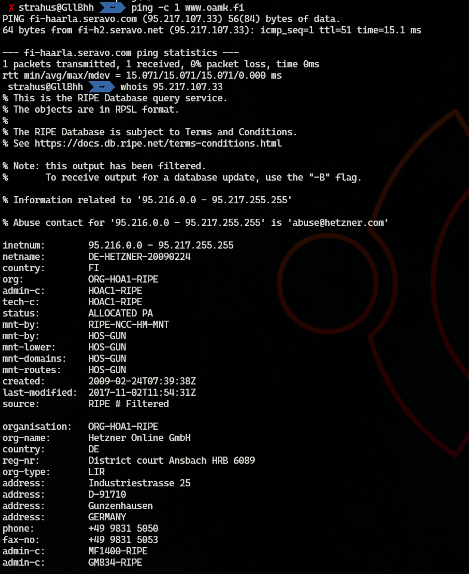

**_Figure 2.8_** — `ping -c 1 www.oamk.fi` and `whois 95.217.107.33` commands output.

From the image we can see that `ping` command gets a reply from a following IP address: **95.217.107.33**

- Use some IP whois lookup web service to resolve which company is hosting and has that IP address and server? (www.oamk.fi)
  - **Hetzner Online GmbH, DE**
- What is the inetnum or route/network (IP address range) the www.oamk.fi's IP address belongs to?
  - **95.216.0.0 - 95.217.255.255**
- What is abuse contact email address of that network range?
  - **abuse@hetzner.com**

### 13. Use traceroute (tracert in MS Windows command shell) to [www.whitehouse.gov](www.whitehouse.gov)

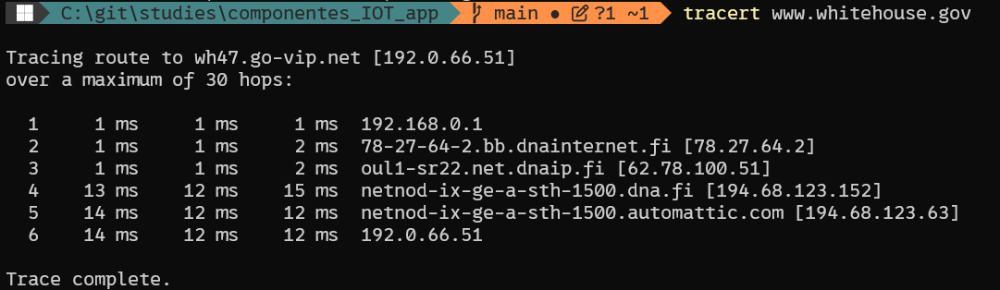

**_Figure 2.9_** — `tracert www.whitehouse.gov` command output

- What is the internet service provider's first router IP address near you? (it's most likely the 2nd router/hop, immediately after your home network)
  - my provider is DNA
  - First router IP: **78.27.64.2**
- How many hops (routers) are there to the www.whitehouse.gov from your device?
  - It took 6 hops from my home network to reach [www.whitehouse.gov](www.whitehouse.gov)
- Use traceroute again, but this time to Google's public DNS server in 8.8.8.8, and Quad9 DNS in 9.9.9.9. How far are those?
  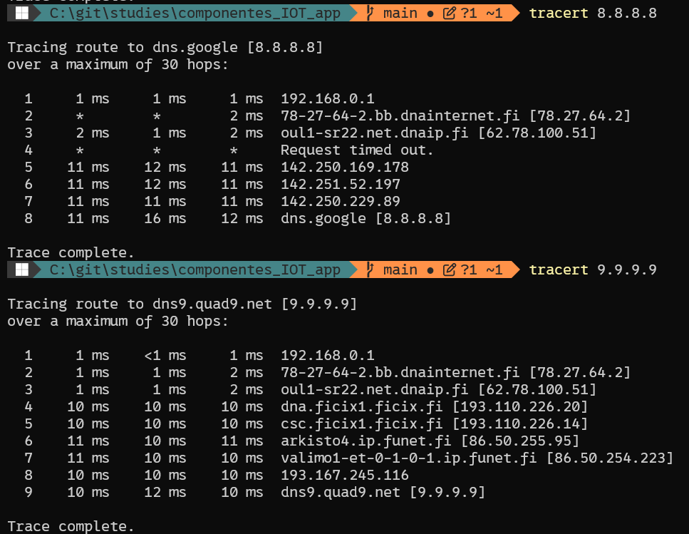

  **_Figure 2.10_** — Traing 8.8.8.8 and 9.9.9.9
  - 8.8.8.8 is 8 hops away from my host
  - 9.9.9.9 is 9 hops away

- Why traceroute does not always work, and does not show the route up to the final destination IP, or there are timeouts for some routers (\* is timeout)? For example, IP address of education.gov.au
  - Traceroute relies on routers sending back ICMP Time Exceeded messages when the packet's TTL (Time To Live) reaches zero. In reality, many routers are configured not to respond to these probes, which causes \* timeouts in the output. On WSL for some reason more peers return `* * *`. Apparently, the mechanism is different (or there is something different in WSL networking settings that I am not aware of)
- Use traceroute and DNS to estimate/guess from response DNS names, round trip times, and with IP whois lookups, where the web server reliefweb.int is located (continent, country or so)?
  - The domain www.reliefweb.int resolves to several AWS IP addresses. A WHOIS lookup of 100.27.176.231 shows that it belongs to the AMAZON-IAD network, operated by Amazon Data Services Northern Virginia. A reverse DNS lookup returns ec2-100-27-176-231.compute-1.amazonaws.com, indicating that the server is hosted on Amazon EC2 infrastructure. Based on this evidence, the website is likely hosted in the AWS US East (Northern Virginia, USA) region.

    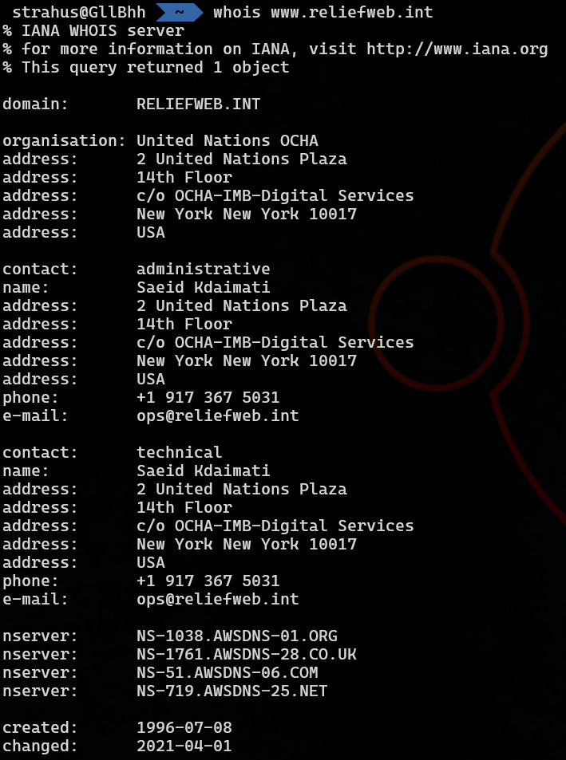

    **_Figure 2.11_** — whois [www.reliefweb.int](www.reliefweb.int)

    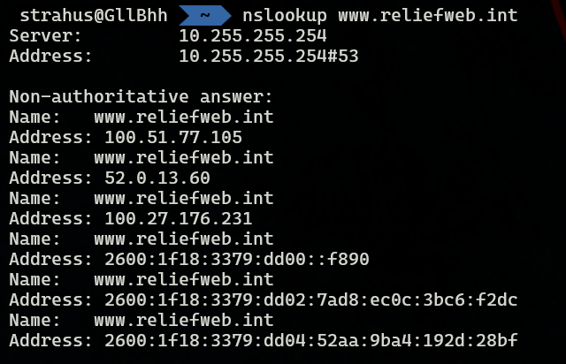

    **_Figure 2.12_** — whois [www.reliefweb.int](www.reliefweb.int)

### 14. Use Ficix statistics web page and answer:

- What is the most quiet IP traffic hour in the Ficix 1 exchange point?
  - 04:00-05:00 seems to be the most quiet hour
    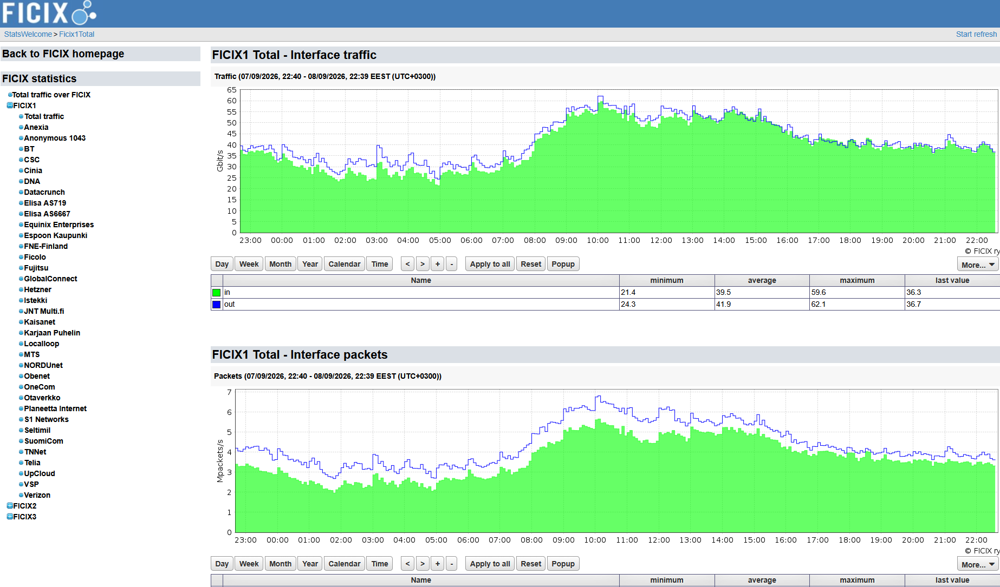

    **_Figure 2.13_** — IP traffic over time

- Which organisations or companies are connected to Ficix 3?
  - CSC
  - Cinia
  - DNA
  - Elisa AS719
  - FNE
  - GleSYS
  - Kaisnet
  - Lounea
  - Telia
  - Valoo

    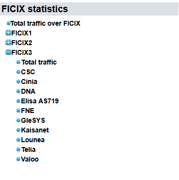

    **_Figure 2.14_** — FICIX 3: connected companies

### 15. List all private IPv4 networks (RFC1918)

**RFC 1918 defines three private IPv4 address ranges:**

| CIDR         | Address Range                 | Number of Addresses |
| ------------ | ----------------------------- | ------------------- |
| 10.0.0.0/8   | 10.0.0.0 - 10.255.255.255     | 16,777,216          |
| 172.         | 172.16.0.0 - 172.31.255.255   | 1,048,576           |
| 192.168.0.0/ | 192.168.0.0 - 192.168.255.255 | 65,536              |

### 16. What is the purpose of IPv4 private networks?

IPv4 has only about 4.3 billion addresses, which is not enough for every device in the world to have a unique public IP address. Private address ranges allow organizations to reuse the same addresses internally.

For example, millions of networks can simultaneously use **192.168.0.1, 192.168.0.100** without causing any conflicts. Only a router will need a public IP address. Devices behind the router use private ip addresses and communicate with the Internet through NAT (Network Address Translation).

### 17. List and explain three or more purposes and features of the ICMP and or ICMPv6 protocol

1. **Error Reporting**

   ICMP informs a sender when a packet cannot be delivered.

   Examples:
   - Destination Unreachable
   - Port Unreachable
   - Network Unreachable

2. **Network Diagnostics (Ping)**

   The ping command uses ICMP Echo Request and Echo Reply messages to test connectivity. The sender transmits an Echo Request, and the destination replies with an Echo Reply.

   This helps determine:
   - Whether a host is reachable.
   - Packet loss.
   - Round-trip time (RTT).

3. **Route Discovery (Traceroute)**

   `tracert` and `traceroute` rely on ICMP messages to discover the path packets take through a network. When a packet's TTL reaches zero the router sends an ICMP Time Exceeded message. This allows traceroute to identify each hop between the source and destination.

### 18. Try to solve these basic IP subnet calculations without checking the solutions:

- If network address is 192.168.100.0, and subnet mask is 255.255.255.224, what is the broadcast address of the network?

  ```
  255.255.255.224 = /27
  2^(32-27) = 32 addresses
  Network: 192.168.100.0
  Broadcast: 192.168.100.31
  ```

- If network address is 1.2.3.4, and broadcast address is 1.2.3.7, what is the subnet mask of the network?

  ```
  Network address 1.2.3.4
  and broadcast address 1.2.3.7
  will result to 2 usable addresses (4 addresses for the network total):
  1.2.3.5
  1.2.3.6

  2^(32-prefix) = 4
  32 - prefix = 2
  prefix = 30

  Subnet mask for /30:
  255.255.255.252
  ```

- If broadcast address is 192.168.129.255 and network mask is 255.255.254.0, what is the network address of the network?

  ```
  255.255.254.0 = /23

  A /23 subnet covers two consecutive /24 networks:
  192.168.128.0 - 192.168.129.255

  Network: 192.168.128.0
  ```

### 19. Try to solve these IP subnetting assignments without checking the solutions and document at least some examples/answers to the learning diary. Answers should contain (for each subnet): Network address, broadcast address and subnet mask:

- **Subnetting task 1:**

  _The address space available is 172.16.64.0/23. Subnet it and create 5 (A, B, C, D and E) IPv4 subnets with following amount of hosts in each network: A = 85, B = 45, C = 95, D = 57, E = 34._

  _Leave some small amount of free addresses to each subnet. Avoid unnecessary waste of IPs._

  ```
  172.16.64.0/23
  Subnet mask: 255.255.254.0
  Network address: 172.16.64.0
  Usable host range: 172.16.64.1 - 172.16.65.254
  Broadcast address: 172.16.65.255
  Address range: 172.16.64.0 - 172.16.65.255
  510 usable addresses

  Network A - min 85 hosts
  Subnet: 172.16.64.0/25
  Network address: 172.16.64.0
  Usable host range: 172.16.64.1 - 172.16.64.126
  Broadcast address: 172.16.64.127
  Address range: 172.16.64.0 - 172.16.64.127
  126 usable addresses

  Network B - min 45 hosts
  Subnet: 172.16.64.128/26
  Network address: 172.16.64.128
  Usable host range: 172.16.64.129 - 172.16.64.190
  Broadcast address: 172.16.64.191
  Address range: 172.16.64.128 - 172.16.64.191
  62 usable addresses

  Network C - min 95 hosts
  Subnet: 172.16.65.0/25
  Network address: 172.16.65.0
  Usable host range: 172.16.65.1 - 172.16.65.126
  Broadcast address: 172.16.65.127
  Address range: 172.16.65.0 - 172.16.65.127
  126 usable addresses

  Network D - min 57 hosts
  Subnet: 172.16.64.192/26
  Network address: 172.16.64.192
  Usable host range: 172.16.64.193 - 172.16.64.254
  Broadcast address: 172.16.64.255
  Address range: 172.16.64.192 - 172.16.64.255
  62 usable addresses

  Network E - min 34 hosts
  Subnet: 172.16.65.128/26
  Network address: 172.16.65.128
  Usable host range: 172.16.65.129 - 172.16.65.190
  Broadcast address: 172.16.65.191
  Address range: 172.16.65.128 - 172.16.65.191
  62 usable addresses

  ```

- **Subnetting task 2:**

  _Same as task 1, but available address space is now 192.168.0.0/25 and networks/hosts are: A = 28, B = 10, C = 60, D = 4._

  _Leave some small amount of free addresses to each subnet. Avoid unnecessary waste of IPs._

  ```
  192.168.0.0/25
  Subnet mask: 255.255.255.128
  Network address: 192.168.0.0
  Usable host range: 192.168.0.1 - 192.168.0.126
  Broadcast address: 192.168.0.127
  Address range: 192.168.0.0 - 192.168.0.127
  126 usable addresses

  Network A - min 28 hosts:
  Subnet: 192.168.0.0/27
  Network address: 192.168.0.0
  Usable host range: 192.168.0.1 - 192.168.0.30
  Broadcast address: 192.168.0.31
  30 usable addresses

  Network B - min 10 hosts:
  Subnet: 192.168.0.32/28
  Network address: 192.168.0.32
  Usable host range: 192.168.0.33 - 192.168.0.46
  Broadcast address: 192.168.0.47
  14 usable addresses

  Network C - min 60 hosts:
  Subnet: 192.168.0.48/26
  Actual network address: 192.168.0.0
  Usable host range: 192.168.0.1 - 192.168.0.62
  Broadcast address: 192.168.0.63
  62 usable addresses


  Network D - min 4 hosts:
  Subnet: 192.168.0.112/29
  Network address: 192.168.0.112
  Usable host range: 192.168.0.113 - 192.168.0.118
  Broadcast address: 192.168.0.119
  6 usable addresses

  ```

- **Subnetting task 3:**

  _IPv6 address space available: 2001:708:510::/48. Create four /64 IPv6 networks._

  ```
  The first 48 bits are fixed: 2001:0708:0510
  To create 4 /64 networks we can use next 16 bits as the subnet IDs:
  Network A: 2001:708:510:0::/64
  Network B: 2001:708:510:1::/64
  Network C: 2001:708:510:2::/64
  Network D: 2001:708:510:3::/64
  ```
