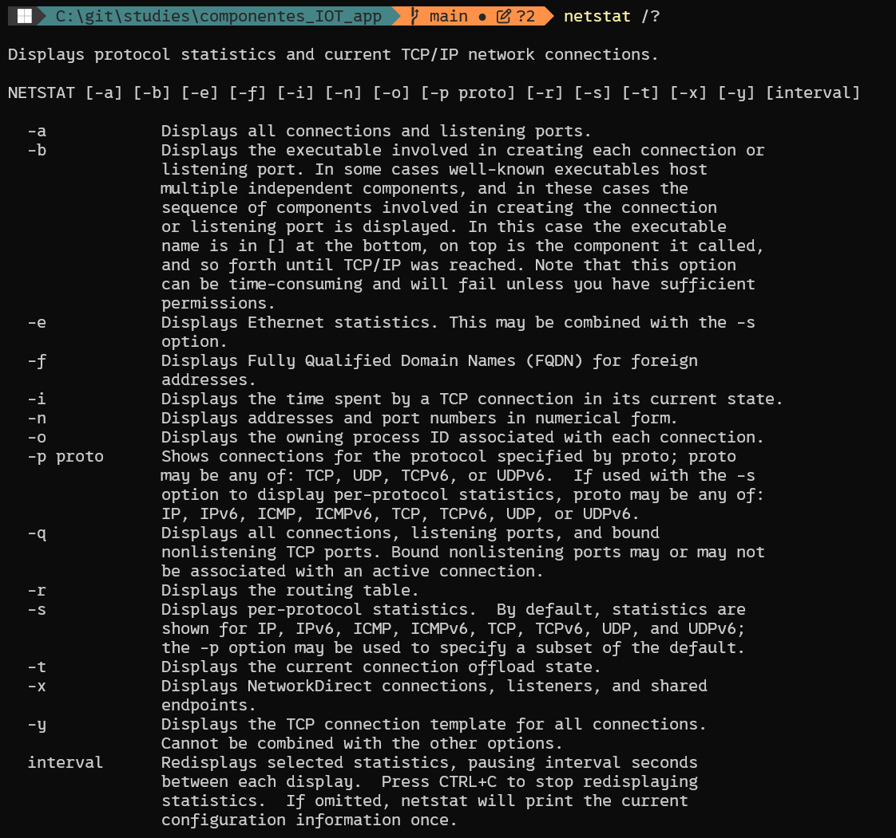
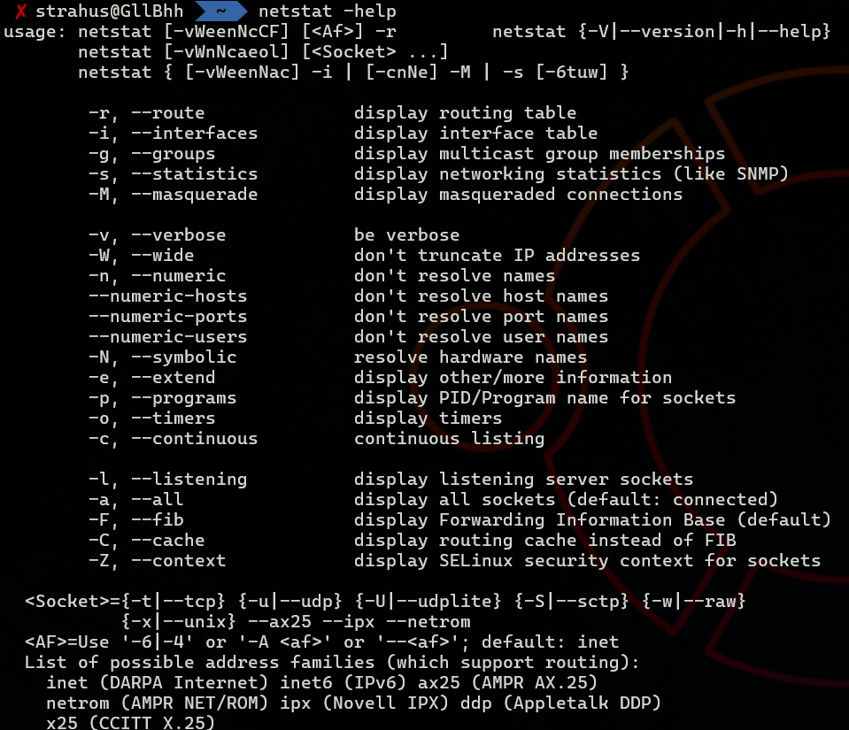

# Components of IoT Application

Gleb Bulygin gbulygin@students.oamk.fi DIN24SP Autumn 2026

---

## Week 3

### 20. Answer these questions:

- **Explain shortly the purpose of TCP acknowledgment and sequence numbers**

  **_Sequence numbers_** let the receiver reassemble the byte stream in the correct order and detect missing or duplicate data. **_Acknowledgment numbers_** tell the sender which bytes have been received successfully, so lost segments can be identified and retransmitted.

- **What is the purpose of TCP SYN bit?**

  The **_SYN (Synchronize)_** flag is used to initiate a connection and synchronize initial sequence numbers between the two hosts during the three-way handshake.

- **What is the purpose of TCP reset bit?**

  The **_RST (Reset)_** flag immediately aborts a connection, typically sent when a segment arrives for a connection that doesn't exist or when an error requires the connection to be terminated abruptly.

- **When TCP retransmissions occur?**

  Retransmissions occur when the sender doesn't receive an acknowledgment for a segment within the expected time (retransmission timeout), or when duplicate ACKs indicate a segment was lost.

- **What is flow-control? (for IP family protocols such as TCP)**

  **_Flow control_** prevents a sender from overwhelming a receiver by sending data faster than it can process. TCP uses a sliding window mechanism where the receiver advertises how much buffer space it has available.

- **Explain TCP connection state LISTENING**

  **_LISTENING_** is the state of a server socket that is waiting for incoming connection requests (SYN segments) on a specific port, but no connection has been established yet.

- **Explain TCP connection state ESTABLISHED**

  **_ESTABLISHED_** means the three-way handshake has completed successfully and both endpoints can now exchange data over the connection.

- **What is the purpose of TCP or UDP source port?**

  The **_source port_** identifies the sending application/process, allowing return traffic to be delivered back to the correct application on the originating host.

- **What is the purpose of TCP or UDP destination port?**

  The **_destination port_** identifies which application or service on the receiving host should process the incoming data.

- **What are the common well-known network service names for these TCP ports: 22, 23, 25, 80, 443, 3306?**
  - 22 — SSH (Secure Shell)
  - 23 — Telnet
  - 25 — SMTP (Simple Mail Transfer Protocol)
  - 80 — HTTP
  - 443 — HTTPS
  - 3306 — MySQL

- **What are common connection-oriented protocol features/advantages, and why TCP is such protocol?**

  Connection-oriented protocols establish a session before data transfer, guarantee ordered and reliable delivery, and provide error checking, retransmission, and flow/congestion control. TCP is connection-oriented because it uses the three-way handshake to establish a session, acknowledgments and sequence numbers to guarantee reliable, in-order delivery, and closes the connection explicitly when finished.

- **What are connectionless protocols features (or lack of), and why UDP is connectionless protocol?**

  Connectionless protocols send data without establishing a session, provide no guarantee of delivery, ordering, or duplicate protection, and have minimal overhead. UDP is connectionless because it simply sends datagrams to a destination port without a handshake, acknowledgments, or retransmission.

- **Why most services using UDP prefer max 512 byte UDP datagrams?**

  512 bytes is small enough to avoid IP fragmentation on virtually all network paths (historically the safe minimum MTU-related size), reducing the risk of packet loss and simplifying delivery since UDP has no built-in retransmission for lost fragments.

- **When it is more reasonable to use UDP instead of TCP?**

  UDP is preferable when low latency matters more than reliability, such as for DNS queries, VoIP, video streaming, or gaming, where retransmission delays or connection overhead would be more harmful than an occasional lost packet.

- **What is the length of TCP header without extra options? What about UDP header?**

  The minimum **_TCP header_** length is 20 bytes. The **_UDP header_** is fixed at 8 bytes.

- **What is TCP Nagle's algorithm? When it should be disabled for networking applications?**

  **_Nagle's algorithm_** buffers small outgoing segments and combines them into fewer, larger packets to reduce network overhead, sending only when a full-sized segment is ready or an ACK is received. It should be disabled (e.g., using the `TCP_NODELAY` socket option) for latency-sensitive applications, such as real-time interactive applications, where small messages need to be sent immediately without buffering delay.

- **What is Maximum Transmission Unit (MTU) and IPv4 fragmentation?**

  The **_MTU_** is the largest size (in bytes) a single network frame/packet can have on a given link (commonly 1500 bytes for Ethernet). When an IPv4 packet is larger than the MTU of a link it must cross, it is split into smaller pieces — **_fragmentation_** — which are reassembled at the destination.

- **What is a raw socket?**

  A **_raw socket_** allows an application to send and receive packets directly at the IP layer (or lower), bypassing the normal TCP/UDP transport processing. It gives direct access to protocol headers, which is useful for tools like ping, traceroute, or custom protocol implementations, and typically requires elevated privileges.

- **What is port forwarding?**

  **_Port forwarding_** is a NAT/router configuration that redirects incoming traffic on a specific external port to a specific internal IP address and port, allowing devices behind a NAT/firewall to be reached from the outside network.

### 21. Describe these protocols or services shortly:

- **IPSec** — a suite of protocols that authenticates and encrypts IP packets, commonly used to build secure VPN tunnels between hosts or networks.

- **RTP and RTCP** — **_RTP (Real-time Transport Protocol)_** carries real-time audio/video data (e.g., VoIP, video calls) over UDP with timestamps and sequence numbers for playback synchronization. **_RTCP (RTP Control Protocol)_** runs alongside RTP to provide quality-of-service feedback, such as packet loss and jitter statistics.

- **QUIC (IETF)** — a transport protocol built on top of UDP that provides reliable, ordered, multiplexed streams with built-in TLS encryption and faster connection establishment than TCP+TLS. It is the basis for HTTP/3.

- **Wireguard** — a modern, lightweight VPN protocol that uses state-of-the-art cryptography to create secure, encrypted point-to-point tunnels, known for its simplicity and high performance compared to IPSec/OpenVPN.

- **DoH** — **_DNS over HTTPS_**, which encrypts DNS queries and responses inside HTTPS traffic, preventing eavesdropping or tampering with DNS lookups.

- **Round-robin DNS** — a load-balancing technique where a DNS name resolves to multiple IP addresses, and the DNS server returns them in rotating order so client requests are distributed across several servers.

- **LDAP** — **_Lightweight Directory Access Protocol_**, used to query and manage directory services (e.g., user accounts, groups) such as Active Directory over a network.

- **Radius** — **_Remote Authentication Dial-In User Service_**, a protocol for centralized authentication, authorization, and accounting (AAA), commonly used for network access such as VPNs, Wi-Fi, and switches.

- **Syslog** — a standard protocol/format for sending log messages from devices and applications to a centralized logging server for storage and analysis.

- **NTP** — **_Network Time Protocol_**, used to synchronize clocks between computers over a network to a common, accurate time source.

- **SNMP** — **_Simple Network Management Protocol_**, used to monitor and manage network devices (routers, switches, servers) by collecting status information and sending configuration changes.

- **SMTP** — **_Simple Mail Transfer Protocol_**, used to send and relay email messages between mail servers and from clients to servers.

- **SMB/CIFS** — **_Server Message Block / Common Internet File System_**, a protocol used mainly on Windows networks for sharing files, printers, and other resources between computers.

### 22. When listing services with netstat command, what is the meaning if some network service is LISTENING and binded to the IP address 127.0.0.1? What if the service is LISTENING IP address 0.0.0.0?

A service **_LISTENING on 127.0.0.1_** is bound only to the loopback interface, so it only accepts connections originating from the same local machine — it is not reachable from other hosts on the network.

A service **_LISTENING on 0.0.0.0_** is bound to all available network interfaces on the host, meaning it accepts connections coming from any IP address/interface, including the local network or the Internet (depending on firewall rules), not just from the local machine.

### 23. Why some applications are using or offer "keepalive" mechanism to maintain established connection (for example SSH connections)?

**_Keepalive_** periodically sends small probe packets over an idle connection to detect whether the other end (or the network path) is still reachable. It prevents intermediate devices, such as NAT routers or firewalls, from silently closing idle connections after a timeout, and allows the application to detect a dead peer quickly and close/reconnect instead of waiting indefinitely on a broken connection.

### 24. Study available options with command line command "netstat /?" (Windows) or netstat –help (Linux, maybe MacOS). What different things you can check with netstat command?

> And here I learned (I've noticed it before but never really asked the question) PowerShell cmdlets use -parameter syntax (for example, `Get-Process -Name notepad`), while external programs such as `netstat`, `ipconfig`, and `net use` use whatever argument style their developers chose, often `/option` or sometimes `-option`. A quick check is `Get-Command <name>`: if it's a Cmdlet, use `Get-Help`; if it's an Application (.exe), use the program's own help such as `/?` or `--help`.

On Windows, `netstat /?` lists the following options:

- **`-a`** — displays all active connections and listening ports.
- **`-b`** — displays the executable involved in creating each connection or listening port.
- **`-e`** — displays Ethernet (interface) statistics, can be combined with `-s`.
- **`-f`** — displays fully qualified domain names (FQDN) for foreign addresses.
- **`-i`** — displays the time spent by a TCP connection in its current state.
- **`-n`** — displays addresses and port numbers numerically, without resolving names.
- **`-o`** — displays the owning process ID (PID) associated with each connection.
- **`-p proto`** — filters output to show only connections/statistics for a given protocol (TCP, UDP, TCPv6, UDPv6, IP, IPv6, ICMP, ICMPv6).
- **`-q`** — displays all connections, listening ports, and bound non-listening TCP ports.
- **`-r`** — displays the routing table.
- **`-s`** — displays per-protocol statistics (IP, IPv6, ICMP, ICMPv6, TCP, TCPv6, UDP, UDPv6).
- **`-t`** — displays the current connection offload state.
- **`-x`** — displays NetworkDirect connections, listeners, and shared endpoints.
- **`-y`** — displays the TCP connection template for all connections.
- **`interval`** — redisplays statistics repeatedly, pausing the given number of seconds between refreshes.

Overall, `netstat` can be used to check active TCP/UDP connections and their states, which ports/services are listening, which process/executable owns each connection, the local routing table, per-protocol/interface traffic statistics, and to continuously monitor connections in near real time.

**_Figure 3.1_** — `netstat /?` command output

**_Figure 3.2_** — `netstat -help` command output (Ubuntu)

### 25. Do the 50 ms mystery quiz from [https://mysteries.wizardzines.com/](https://mysteries.wizardzines.com/). What was the cause of extra 50 ms delay?

**Here is what was happening:**

1. The client opens the connection.
2. The client sends some data (the start of a POST request)
3. The server waits to ACK (because it's using delayed ACKs)
4. The client waits to send more packets (because it's using Nagle's algorithm)
5. Oh no! The server is waiting for the client and client is waiting for the server! We're stuck!!!!
6. After 40ms (that number we've been seeing everywhere!!), the server finally gives up and sends an ACK packet
7. The client sends more data and everything continues

**Fix:**

**_Disable Nagle's algorithm on the client side_**

**or**

**_Do not split POST request into 2 parts_**

---
