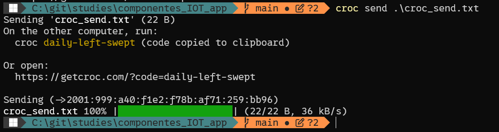
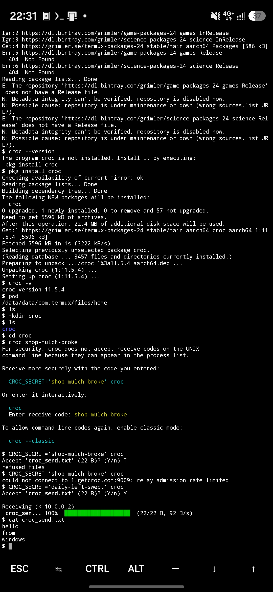
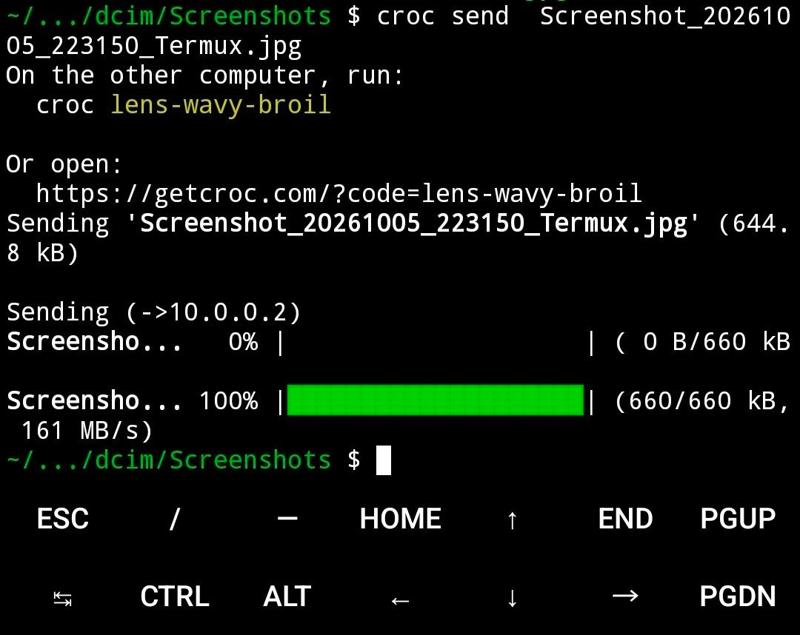
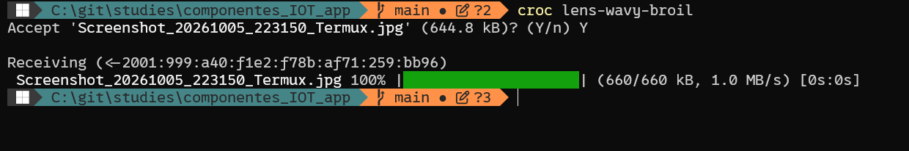
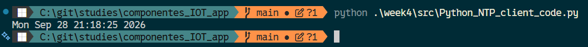

# Components of IoT Application

Gleb Bulygin gbulygin@students.oamk.fi DIN24SP Autumn 2026

---

## Week 4

### 26. Use [Croc](https://github.com/schollz/croc) to move file or files between two or more hosts/devices. Answer shortly:

I have installed **croc** on Windows with `choco install croc` command (PowerShell as Admin).

I have installed **croc** on Android with `pkg install croc` (I use **termux** app).

**_Figure 4.1_** — Sending files via **croc** from powershell

**_Figure 4.2_** — Recieve file via **croc** on Android.

> I accidentally cancelled the first file send, but on the second try it worked. Also, before the next screenshot I reinstalled the **termux** app. The one I used initially was the outdated version from the Google Playstore. It had quite a few issues. I installed latest version from the F-Droid.

> My phone in on cellular data and my windows host is connected to my home Wi-Fi.

> Then I have moved the screenshot above from my Android phone to my laptop.

**_Figure 4.3_** — Send a file from Android via **croc**.

**_Figure 4.4_** — Screenshot successfully received on Windows.

- **How the Croc works?**

  Both sides pick/generate a one-time code phrase. This phrase is used in a **PAKE** (Password Authenticated Key Exchange) handshake, which lets sender and receiver derive the same secret encryption key without ever sending the phrase itself over the network. Croc then encrypts the file (AES-256/ChaCha20) and transfers it directly between the two hosts if they can reach each other, falling back to a relay server otherwise.

- **How the Croc moves files if both hosts are not directly visible to each other? (for example, both are behind NATs or basic firewalls)**

  Both hosts only make **outbound** connections to a public (or self-hosted) **relay server** — no incoming ports or port-forwarding are needed. The relay server acts as a rendezvous point: it helps the two peers find each other and, if a direct peer-to-peer connection can't be made (common when both are behind NAT/firewalls), it simply pipes the already end-to-end encrypted traffic between them. Since the data is encrypted before it reaches the relay, the relay operator can't read the file contents.

### 27. Study how NTP protocol operates and analyse this [Python NTP client code](https://tl.oamk.fi/iot/dl/ntp_client.html). Also available here as [plain text](https://tl.oamk.fi/iot/dl/ntp_client.txt).

- This Python script uses direct socket programming to access the NTP server. Comment individual socket programming related code lines. Also, answer these:
  - **What is the NTP server (DNS) hostname?**

    `pool.ntp.org` — the default `host` parameter of the `ntp_time()` function.

  - **What is the destination port number being used?**

    Port **123**, the default `port` parameter of `ntp_time()` and the standard well-known port for the NTP protocol.

  - **Is this Python script using TCP or UDP? How do you know?**

    It's using **UDP**. The socket is created with `SOCK_DGRAM` (`socket(AF_INET, SOCK_DGRAM)`), which is the datagram/UDP socket type, as opposed to `SOCK_STREAM` which would indicate TCP. The code also uses `sendto()`/`recvfrom()` instead of `connect()`/`send()`/`recv()`, which is typical of connectionless UDP usage — the socket is never explicitly connected to the server before sending data.

- Try to execute the app with Python

**_Figure 4.5_** — `Python_NTP_client_code` execution in the terminal

### 28. Do these Python programming assignments with Windows or Linux (or with MacOS if you want and know how)

- For example, use https://realpython.com/python-sockets/ or similar site(s) for socket programming example codes and create TCP client and TCP server Python scripts
- Establish a TCP connection between your client and server Python scripts (either as localhost traffic or between two separate hosts if you have access to two or more Python running hosts without firewall preventing the traffic)
- Transfer some ASCII text strings between the hosts
  - TCP client connects to the server, sends some plain text string and then disconnects
  - Server prints the text to the console or elsewhere
  - Save your source codes and work. You need scripts again during the course week #5 (Wireshark **protocol** analyzer assignments)
- Use netstat or similar command line tools to check the TCP connection status (for example the Python server script LISTENING the selected TCP port)
