# Components of IoT Application

Gleb Bulygin<br>gbulygin@students.oamk.fi<br>DIN24SP<br>Autumn 2026

---

## Week 5

### 29. Define following terms and concepts shortly:

- **What is the difference between encoding and encryption?**

  **Encoding** transforms data into another format so it can be stored or transmitted correctly (e.g. binary data as text). The algorithm is public and no key is needed, so anyone can decode it. Its purpose is **usability/compatibility**, not secrecy.

  **Encryption** transforms data so that only someone holding the right **key** can read it. Its purpose is **confidentiality** (and often integrity/authenticity). Without the key, the ciphertext should be practically impossible to reverse.

  > Base64 looks unreadable, but it is _not_ encryption — anyone can decode it.

- **List few common encryption algorithms or systems**
  - **AES** (Advanced Encryption Standard) — symmetric block cipher, the most widely used today
  - **ChaCha20** (often with Poly1305) — fast symmetric stream cipher, used in TLS and WireGuard
  - **RSA** — asymmetric (public/private key) algorithm, used for key exchange and digital signatures
  - **ECC** (Elliptic Curve Cryptography, e.g. ECDH, ECDSA, Ed25519) — asymmetric, smaller keys than RSA for the same security
  - **3DES / DES** — older symmetric ciphers, now considered obsolete
  - Systems/protocols built on these: **TLS/SSL** (HTTPS), **SSH**, **PGP/GPG**, **IPsec**, **WPA2/WPA3** (Wi-Fi)

- **List few common encoding systems**
  - **ASCII** and **Unicode** (**UTF-8**, **UTF-16**) — character encodings
  - **Base64** — binary data as printable ASCII text (e-mail attachments, data URIs, JWT)
  - **Hexadecimal** — binary bytes as `0-9A-F` characters
  - **URL encoding** (percent-encoding) — e.g. space → `%20`
  - **HTML entities** — e.g. `<` → `&lt;`
  - Physical/line encodings like **Manchester** encoding, and media codecs like **MP3**/**H.264**

- **What are plain text protocols? List some**

  Plain text protocols send their commands and data as human-readable, **unencrypted** text over the network. They are easy to debug (you can read them directly in Wireshark), but anyone who can capture the traffic can also read (and modify) it — including usernames and passwords.

  Examples: **HTTP**, **FTP**, **Telnet**, **SMTP**, **POP3**, **IMAP**, **DNS** (classic, over UDP/TCP 53), **MQTT** (without TLS), **SNMP v1/v2c**. Most have secured variants: HTTPS, FTPS/SFTP, SSH, SMTPS, IMAPS, DNS over HTTPS/TLS, MQTTS.

- **Encapsulation (protocol)**

  Encapsulation is how data travels down the network stack: each layer takes the data from the layer above as its **payload** and wraps it with its own **header** (and sometimes trailer). For example:

  ```text
  Application data (HTTP)
    → TCP segment     [TCP header | HTTP data]
    → IP packet       [IP header | TCP header | HTTP data]
    → Ethernet frame  [Eth header | IP header | TCP header | HTTP data | FCS]
  ```

  The receiver does the reverse (**decapsulation**), stripping one header per layer. This is exactly what Wireshark shows as nested layers when you open a packet.

- **JSON, XML, YAML, CSV**

  Common text-based formats for structured data:
  - **JSON** (JavaScript Object Notation) — key/value objects and arrays, e.g. `{"temp": 21.5}`. Lightweight and the de facto standard for web APIs and IoT messages.
  - **XML** (eXtensible Markup Language) — data in nested tags, e.g. `<temp unit="C">21.5</temp>`. Verbose, but supports attributes, namespaces and schema validation (XSD). Used in SOAP, RSS, office documents and e.g. FMI open data.
  - **YAML** (YAML Ain't Markup Language) — indentation-based and very human-readable, e.g. `temp: 21.5`. Mostly used for configuration files (Docker Compose, Kubernetes, GitHub Actions).
  - **CSV** (Comma-Separated Values) — flat tabular data, one record per line with fields separated by commas, e.g. `1586544298,21.5`. Simple and compact, ideal for logs and spreadsheets, but has no nesting or data types.

### 30. Install Wireshark protocol analyser and inspect your IP traffic (DNS requests, web browsing and such) with the Wireshark:

> Wireshark is a network packet analyzer. A network packet analyzer presents captured packet data in as much detail as possible.
>
> You could think of a network packet analyzer as a measuring device for examining what’s happening inside a network cable, just like an electrician uses a voltmeter for examining what’s happening inside an electric cable (but at a higher level, of course).
>
> In the past, such tools were either very expensive, proprietary, or both. However, with the advent of Wireshark, that has changed. Wireshark is available for free, is open source, and is one of the best packet analyzers available today.
>
> _from [www.wireshark.org](https://www.wireshark.org/docs/wsug_html_chunked/ChapterIntroduction.html#ChIntroWhatIs)_

- **Analyse the plain text traffic between the TCP socket Python scripts you did during the course week #4.**

  > Note: use localhost network interface when capturing host internal traffic (localhost/127.0.0.1)

  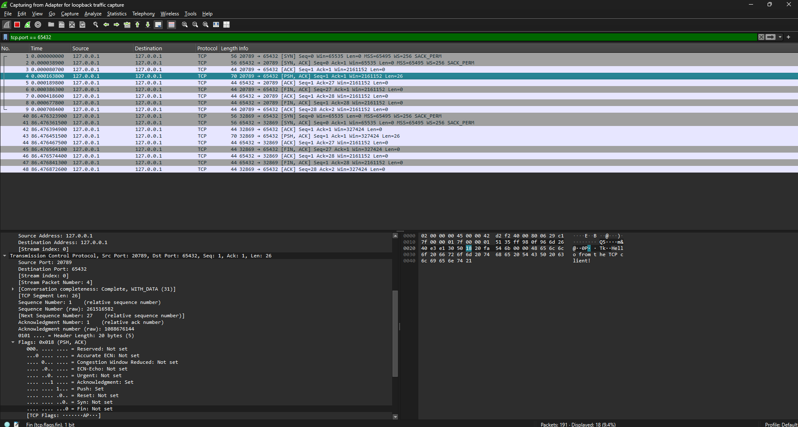

  **_Figure 5.1_** — TCP traffic captured with Wireshark. The payload (26 bytes) was transmitted in packet No. 4.

- **Try to ping 8.8.8.8 from command prompt and capture the traffic. What protocols ping was using? What is the total header length of your ping request (all used protocol headers combined when ping sends echo request)?**

  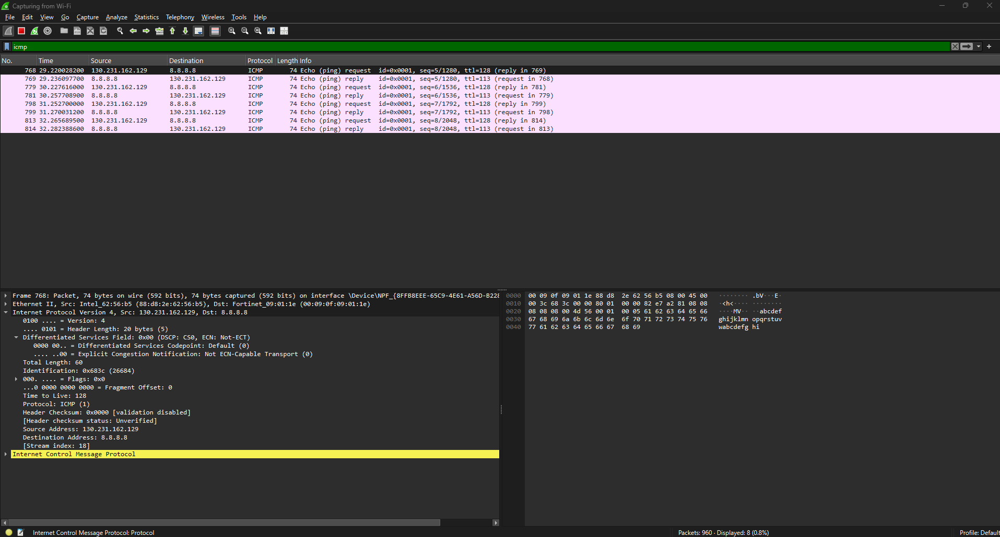

  **_Figure 5.2_** — Ping command traffic

  Ping uses **ICMP** (Echo request/reply), carried in **IPv4** inside an **Ethernet II** frame. To capture the ping traffic I applied the `icmp` filter.
  - Frame Length = 74 bytes
  - IP length = 60 bytes
  - Therefore the **Ethernet header** is 74 - 60 = **14 bytes**
  - The **IP header** is **20 bytes** (shown in the **Internet Protocol** details)
  - The **ICMP** message is 60 - 20 = 40 bytes and its data is 32 bytes, so the **ICMP header is 8 bytes**

  | Header     | Size (bytes) |
  | ---------- | ------------ |
  | Ethernet   | 14           |
  | IP         | 20           |
  | ICMP       | 8            |
  | **Total:** | **42**       |

- **Capture some web browsing traffic and related DNS requests. What are those A (and maybe AAAA requests)? Which protocol is used for DNS requests?**

  **A record** - requests the website's IPv4 address.

  **AAAA record** - requests the website's IPv6 address.

  > Note: This cannot be done with web browser if your browser uses DNS over HTTPS. Most do now. Either skip this task or disable DoH temporarily in the web browser settings.

  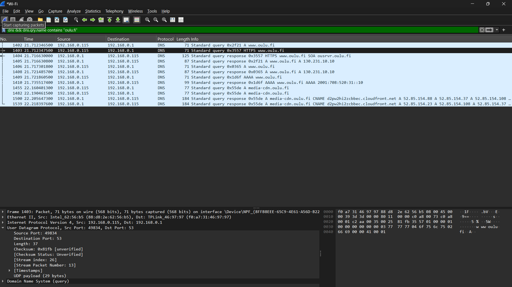

  **_Figure 5.3_** — Traffic related to opening [www.oulu.fi](https://www.oulu.fi)

  To access the website [www.oulu.fi](https://www.oulu.fi), the browser first performed DNS lookups. The capture shows both A and AAAA DNS queries. An A record is used to obtain the IPv4 address of the host, while an AAAA record is used to obtain the IPv6 address. The DNS responses returned IPv4 address 130.231.10.10 and IPv6 address 2001:708:520:31::10 for www.oulu.fi. The DNS requests were transported using the UDP protocol on port 53.

### 31. Download this [zipper pcap traffic file](https://tl.oamk.fi/iot/network_capture_iot.zip) and inspect it with Wireshark. The IP traffic sample is about IoT device sending base64 encoded and JSON formatted data to a server. Answer these questions:

- **What is the total size of captured frame in bits?**
  - 1536 bits
- **What is the payload length (data) in bytes?**
  - 150 bytes
- **What is the source IP address of device sending the traffic?**
  - 194.163.171.214
- **What is the destination IP address receiving the traffic?**
  - 193.167.100.28
- **What is the IP family protocol delivering the data?**
  - IPv4
- **What is the source port?**
  - 49240
- **What is the destination port?**
  - 8080
- **Extract the payload as printable text (use right mouse button and copy as printable text for the data part only). Use any base64 decoder to convert the data to a plain text JSON message. What is the content of JSON formatted data?**

  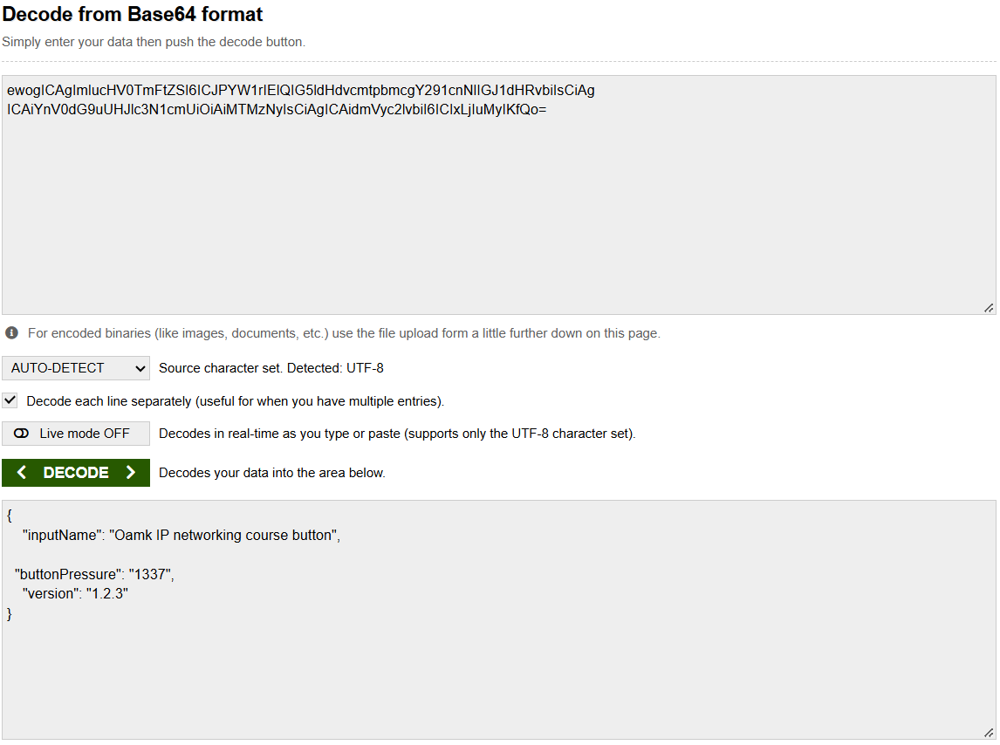

  **_Figure 5.4_** — Decoded data

  To get the base64 string I right-clicked on the frame and selected `Follow -> UDP Stream`, which allowed me to copy the base64 string. Then I used [base64decode.org](https://www.base64decode.org/) to decode it:

  ```json
  {
  	"inputName": "Oamk IP networking course button",
  	"buttonPressure": "1337",
  	"version": "1.2.3"
  }
  ```

  > Hint: If you struggle with this task, you can get the UDP payload if you select the UDP datagram with right mouse button in the Wireshark packet view, and use “Follow”. It gives you the UDP packet data payload as ASCII text you can copy-paste from the Wireshark popup window to any common base64 decoder.

### 32. Download this [zipper pcap traffic file](https://tl.oamk.fi/iot/network_capture_mysql.zip) and inspect it with Wireshark. Traffic is simple MySQL session example from Wireshark Wiki. Answer these questions:

- **What is the destination IP address receiving the traffic?**
  - 192.168.0.254
- **What is the destination TCP port?**
  - 3306
- **Use Wireshark's follow TCP stream feature (right mouse button) and inspect what are the two database rows (animals) and related values which were inserted to the foo table's animal and name columns?**
  - "dog", "Goofy"
  - "cat", "Garfield"

  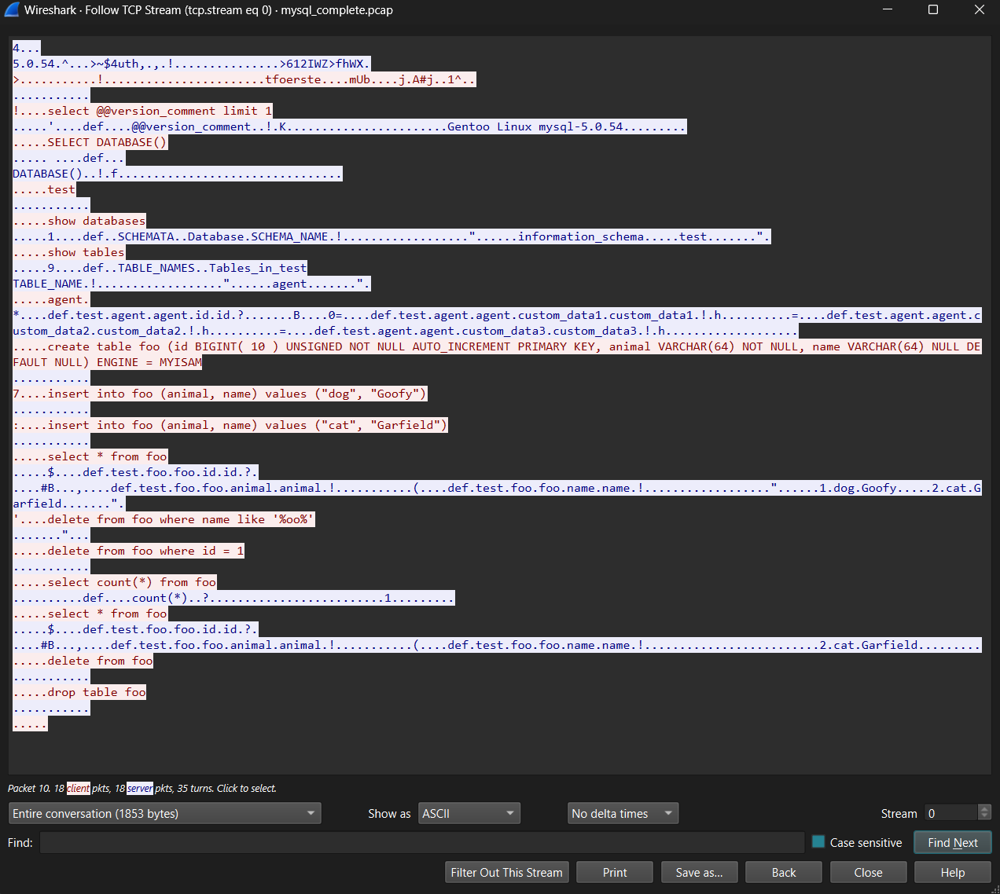

  **_Figure 5.5_** — MySQL TCP data

### 33. Download this [zipped pcap traffic file](https://tl.oamk.fi/iot/network_capture.zip) and inspect it with Wireshark. Traffic has been captured from host 192.168.80.32. Answer these questions:

- **What is the MAC address of host 192.168.80.32?**
  - `08:00:27:f1:90:ad`
- **What is the MAC address of host 192.168.80.1? Which vendor has build the ethernet chipset of host 192.168.80.1? (use Wireshark or IEEE OUI data)**
  - `fc:ec:da:4a:84:d3`
  - Ubiquiti Inc.
- **Which IP address sent ICMP echo requests to this (192.168.80.32) host? Also, there is a repeating short message inside ICMP datagrams the host sent as ICMP echo request payload. What is the repeated message?**
  - 192.168.80.58
  - The repeated message is **`Hi there Oamk!`** (the payload shows ` there Oamk!Hi there Oamk!Hi there Oamk!`)
- **What was the web page the host 192.168.80.32 visited first (full web page address, not just the host)? What was the web browser or HTTP user agent string used to access that web server?**
  - [http://www.oamk.fi/~tkorpela/](http://www.oamk.fi/~tkorpela/)
  - `curl/7.68.0`
- **What is the hostname in “Host:” field of the HTTP GET request sent by 192.168.80.32?**
  - `www.oamk.fi`
- **What is most likely the default DNS server (the IP address) used by the host 192.168.80.32?**
  - `8.8.8.8`
- **Use Wireshark’s file/export objects/HTTP feature to extract the ZIP file which was downloaded from the web server 193.167.100.88. What is inside the ZIP file?**

  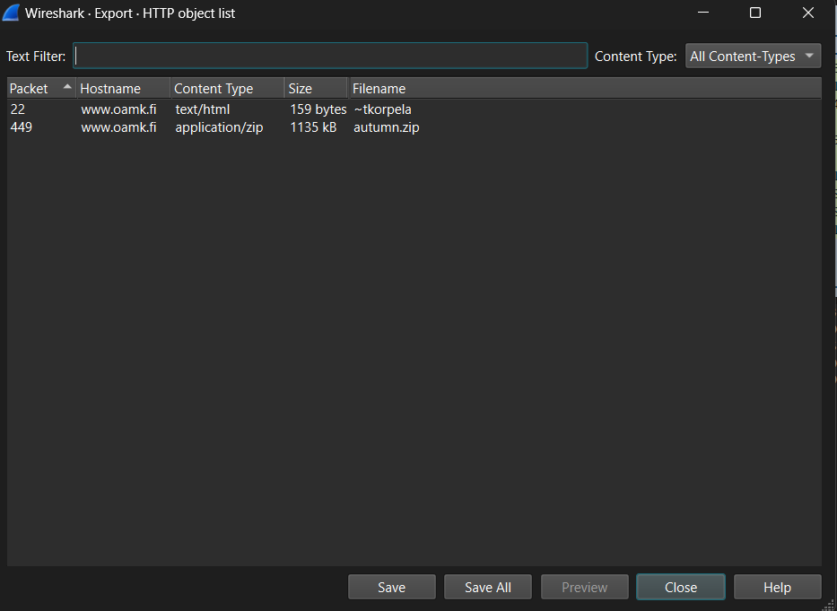

  **_Figure 5.6_** — Export shows `~tkorpela` (text/html) and `autumn.zip` (application/zip)
  - The ZIP file `autumn.zip` contains a single image, `autumn.jpg`.

- **Host 192.168.80.32 sent DNS requests to host 9.9.9.9. What are the requests?**

  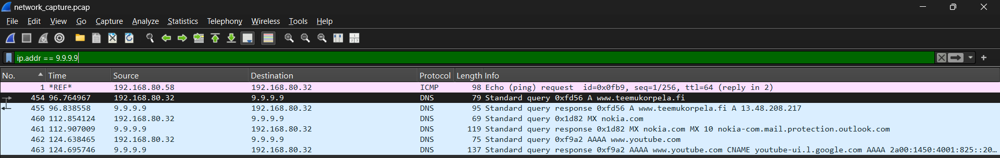

  **_Figure 5.7_** — Requests to 9.9.9.9

  Host 192.168.80.32 sent DNS queries to the public DNS server 9.9.9.9 (Quad9). The queries included an **A** record lookup for www.teemukorpela.fi, an **MX** record lookup for nokia.com and an **AAAA** record lookup for www.youtube.com. The DNS responses returned the corresponding IPv4 address, mail server and IPv6 address. DNS was transported using the UDP protocol.

### 34. Create a new JSON file with any text editor. JSON file should contain data for at least two houses and related IoT sensor data. Each house must have few sensors with following information and some random data for each sensor. Something like this:

```text
House:
- IoT sensor:
  - sensor ID number
  - location description
  - notes about sensor
  - unix epoch timestamp
  - sensor values:
    - value nnn
    - value nnn
    - value nnn
```

```json
{
	"houses": [
		{
			"houseId": 1,
			"name": "Summer cottage",
			"address": "Rantatie 12, 90100 Oulu",
			"sensors": [
				{
					"sensorId": 1001,
					"type": "temperature_humidity",
					"location": "Living room, north wall, 1.5 m above floor",
					"notes": "Battery powered, sends data every 10 minutes over Zigbee",
					"timestamp": 1791280800,
					"values": {
						"temperature_c": 21.4,
						"humidity_pct": 38.2,
						"battery_pct": 87
					}
				},
				{
					"sensorId": 1002,
					"type": "air_quality",
					"location": "Bedroom, on the bookshelf",
					"notes": "USB powered, CO2 calibrated 2026-09-01",
					"timestamp": 1791280860,
					"values": {
						"co2_ppm": 742,
						"tvoc_ppb": 118,
						"pm2_5_ugm3": 4.6
					}
				},
				{
					"sensorId": 1003,
					"type": "water_leak",
					"location": "Kitchen, under the sink",
					"notes": "Alarm is triggered when leak value is 1",
					"timestamp": 1791280920,
					"values": {
						"leak": 0,
						"temperature_c": 18.9,
						"battery_pct": 64
					}
				}
			]
		},
		{
			"houseId": 2,
			"name": "Apartment",
			"address": "Kauppurienkatu 5 B 14, 90100 Oulu",
			"sensors": [
				{
					"sensorId": 2001,
					"type": "temperature_humidity",
					"location": "Bathroom, ceiling next to the vent",
					"notes": "High humidity is expected after showers",
					"timestamp": 1791281400,
					"values": {
						"temperature_c": 24.1,
						"humidity_pct": 71.5,
						"battery_pct": 92
					}
				},
				{
					"sensorId": 2002,
					"type": "energy_meter",
					"location": "Hallway, electrical cabinet",
					"notes": "Measures total power consumption of the apartment",
					"timestamp": 1791281460,
					"values": {
						"power_w": 1245,
						"voltage_v": 231.6,
						"energy_kwh": 5873.42
					}
				},
				{
					"sensorId": 2003,
					"type": "door_motion",
					"location": "Front door",
					"notes": "Door contact and PIR motion sensor in the same device",
					"timestamp": 1791281520,
					"values": {
						"door_open": false,
						"motion_detected": true,
						"battery_pct": 45
					}
				}
			]
		}
	]
}
```

#### Validate your JSON file with validator: [jsonlint.com](https://jsonlint.com/) or [jsonformatter.curiousconcept.com](https://jsonformatter.curiousconcept.com/)

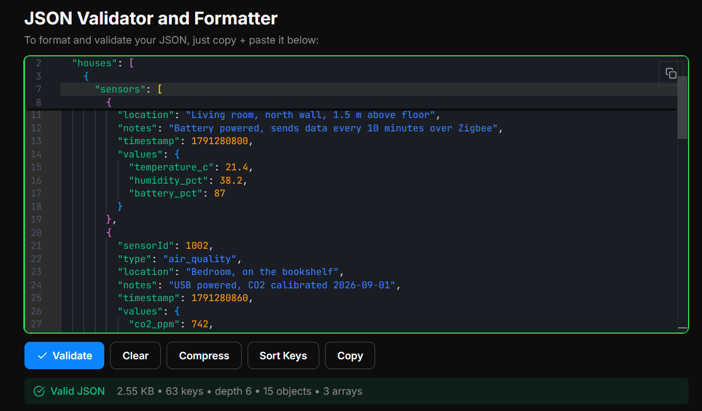

**_Figure 5.8_** — JSON validation

#### What is GraphQL? Also, check this [traffic and parking API documentation from Oulu](https://wp.oulunliikenne.fi/avoin-data/autoliikenne/graphql-rajapinnat/) (extra task uses this API)

- **GraphQL** is a query language for APIs and a server-side runtime for running those queries. Facebook developed it in 2012 and released it as open source in 2015. A REST API has many endpoints, each returning a fixed data structure. A GraphQL API usually has **one endpoint** (`POST /graphql`), and the client sends a query that says exactly which fields it wants. The response is JSON with the same shape as the query.
  - **Schema & types**: the server describes its data with a strongly typed schema (types, fields, relations). Clients can read this schema through _introspection_, which makes self-documenting tools such as GraphiQL possible.
  - **Operations**: `query` reads data, `mutation` changes data and `subscription` gets real-time updates, usually over WebSockets.
  - **Advantages**: no over-fetching (getting fields you don't need) and no under-fetching (needing several requests). Related data comes back in one round trip, which is useful for IoT and mobile clients with limited bandwidth.
  - **Disadvantages**: HTTP caching is harder because everything goes through one POST endpoint. Very complex or deep queries can overload the server. It is also more complex to set up than a simple REST API.

- **Oulu traffic and parking API** ([oulunliikenne.fi](https://wp.oulunliikenne.fi/avoin-data/autoliikenne/graphql-rajapinnat/))
  - Endpoint: `https://api.oulunliikenne.fi/proxy/graphql`
  - Available queries: `carParks` (parking garages with real-time free spaces), `cameras`, `tmsStations` (traffic volume/speed), `weatherStations`, `roadworks`, `trafficAnnouncements`, `maintenanceVehicleRouteEvents`, `maintenanceVehicleObservations` and `trafficFluencyFeatureCollection`.
  - Timestamps are in UTC (ISO 8601) and coordinates use GeoJSON.

  Example query: the name and free spaces of every car park:

  ```graphql
  {
  	carParks {
  		carParkId
  		name
  		spacesAvailable
  		maxCapacity
  	}
  }
  ```

  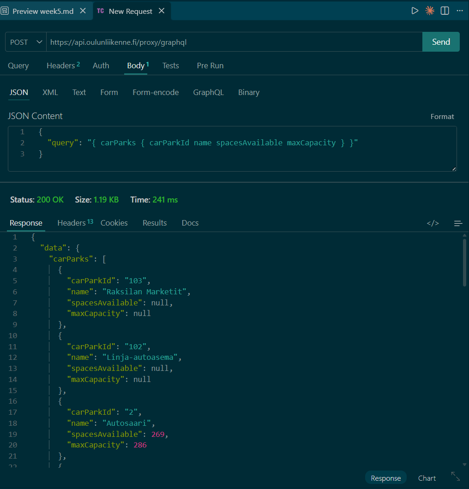

  **_Figure 5.9_** — Oulu traffic parking API test with Thunder Client

### 35. Install Cmder (or some other toolset where you have Curl or similar tool to make HTTP requests from command line or application.) Use Curl to fetch XML formatted weather data from FMI:

```bash
curl -s -L "https://opendata.fmi.fi/wfs?request=getFeature&storedquery_id=fmi::observations::weather::timevaluepair&place=oulu&timestep=100&parameters=temperature"
```

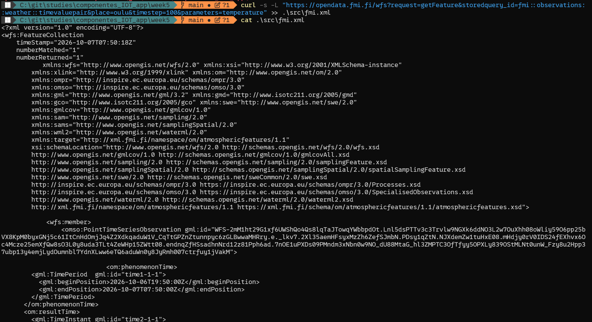

**_Figure 5.10_** — `curl` command output (I saved it to a file `fmi.xml`)

- **Inspect and validate the received XML data with [www.w3schools.com/xml/xml_validator.asp](https://www.w3schools.com/xml/xml_validator.asp)**
  - Result of the check: `No errors found`

### 36. Decode this base64 encoded message with any tool(s) you prefer:

```text
SGVsbG8gdGhlcmUgT2FtayBzdHVkZW50ISBBcmUgeW91IGhhdmluZyBmdW4gbm93Pz8/
```

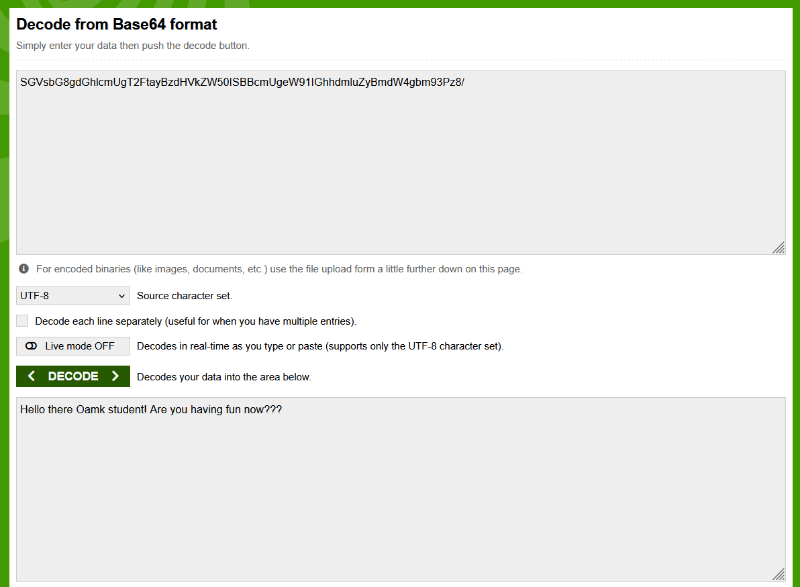

**_Figure 5.11_** — String decoded with [online tool](https://www.base64decode.org/)

- Decoded message: `Hello there Oamk student! Are you having fun now???`

### 37. Encode this string: “I love data processing challenges!” with base64 encoding

Encoded string: `SSBsb3ZlIGRhdGEgcHJvY2Vzc2luZyBjaGFsbGVuZ2VzIQ==`

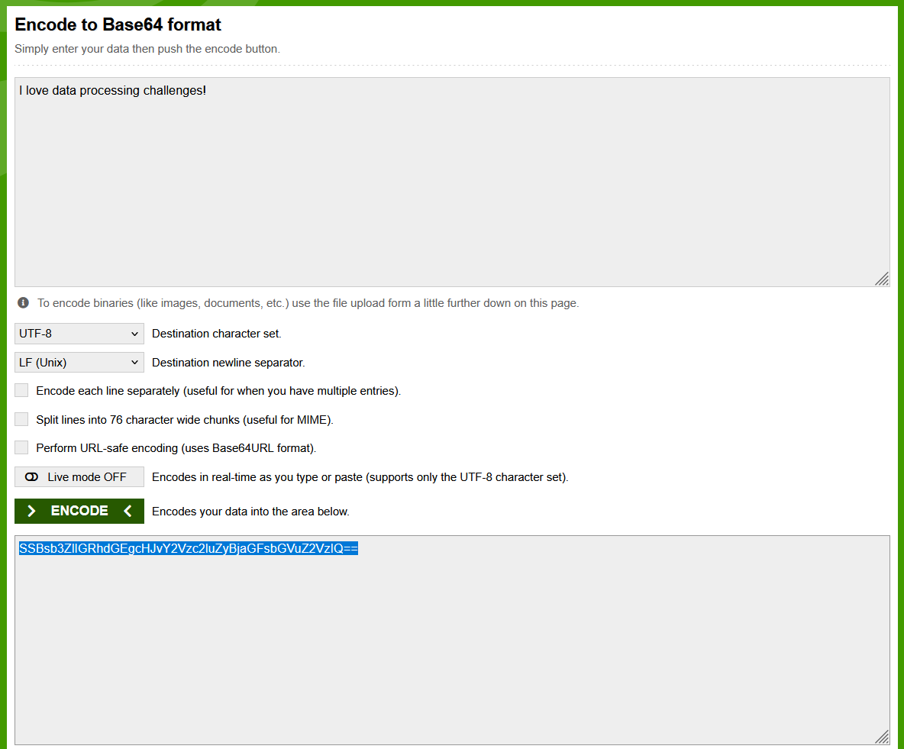

**_Figure 5.12_** — String encoded with [online tool](https://www.base64decode.org/)

---
