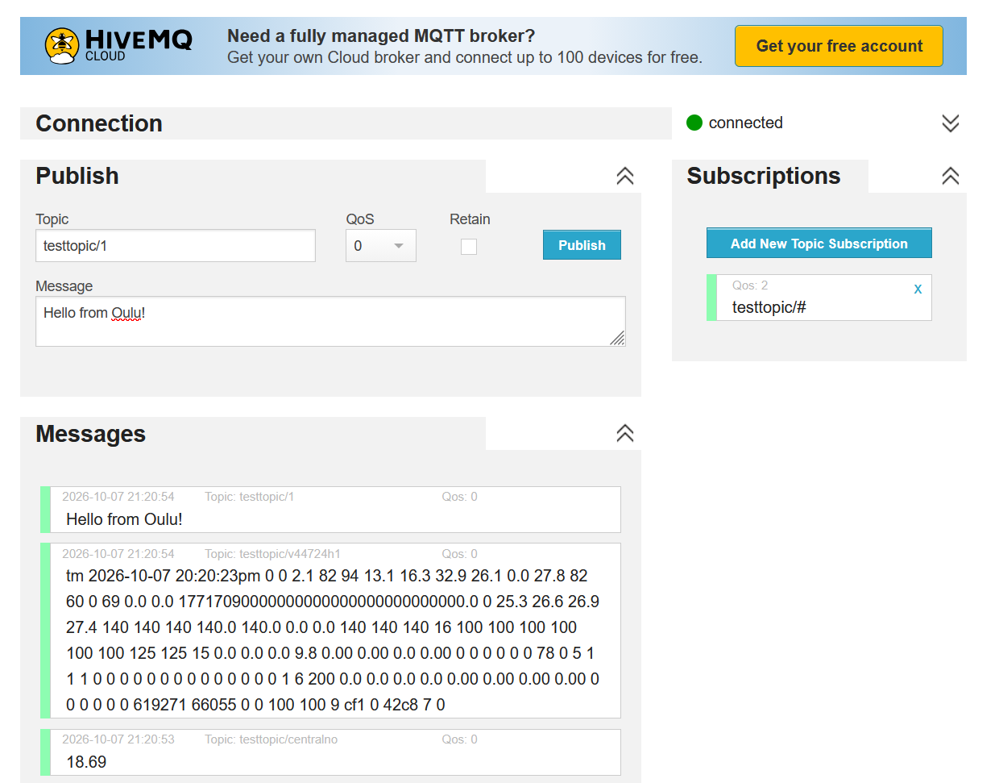
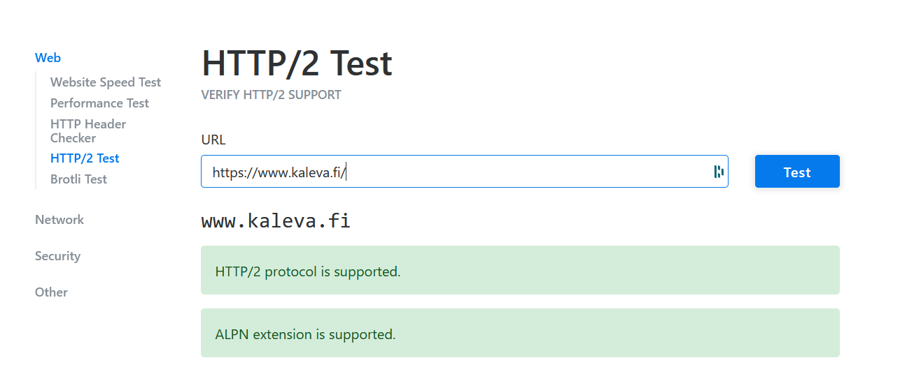
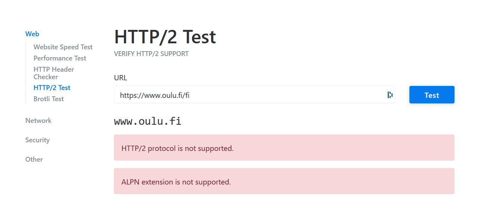
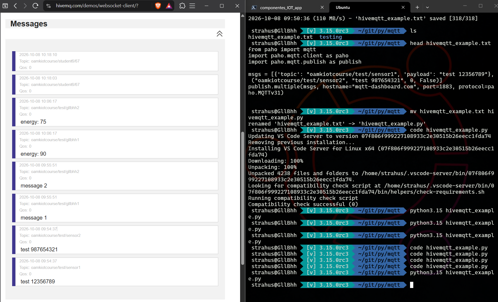
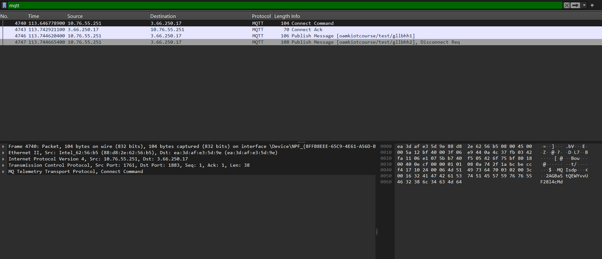
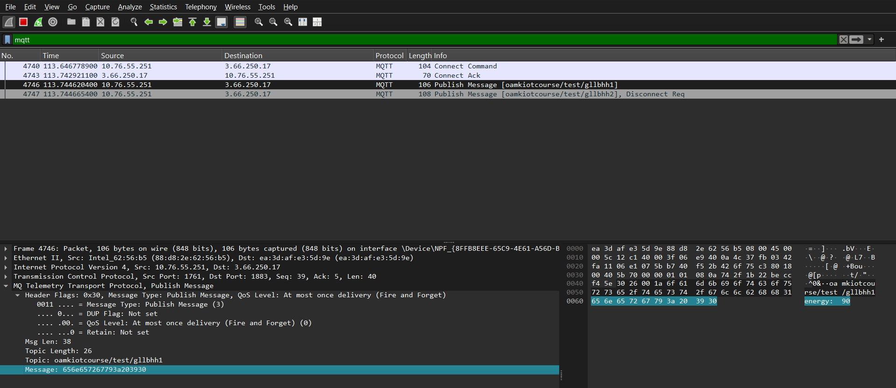

# Components of IoT Application

Gleb Bulygin<br>gbulygin@students.oamk.fi<br>DIN24SP<br>Autumn 2026

---

## Week 6

### 38. Describe the difference between request-response and publish-subscribe communication models

**Request-response** is a direct, one-to-one model: a **client** sends a request to a known **server** and waits for its answer. The client has to know the server's address, and both must be online at the same time. If the client wants new data, it must ask again (**polling**). This is how **HTTP** (REST APIs) and **CoAP** work.

```text
Client ──── GET /temperature ───▶ Server
Client ◀─── 200 OK {"temp": 21.5} ── Server
```

**Publish-subscribe** is an indirect, event-driven model with a middleman called a **broker**. **Publishers** send messages to a **topic** (e.g. `home/kitchen/temp`) without knowing who will receive them. **Subscribers** tell the broker which topics they are interested in, and the broker **pushes** each new message to them as soon as it arrives. Publishers and subscribers never talk directly. This is how **MQTT** works.

```text
Sensor (publisher) ──▶ topic: home/temp ──▶ Broker ──▶ Phone app (subscriber)
                                                   ──▶ Database (subscriber)
                                                   ──▶ Dashboard (subscriber)
```

|               | Request-response                            | Publish-subscribe                                             |
| ------------- | ------------------------------------------- | ------------------------------------------------------------- |
| Communication | One-to-one, client ↔ server                 | One-to-many / many-to-many via a broker                       |
| Coupling      | Client must know the server's address       | Publishers and subscribers don't know each other, only topics |
| Data flow     | **Pull** — client asks when it needs data   | **Push** — data is delivered when it is published             |
| Timing        | Synchronous: client waits for the reply     | Asynchronous: no waiting for a reply                          |
| New data      | Requires polling (repeated requests)        | Delivered instantly on change                                 |
| Scaling       | Server load grows with every client request | Broker fans out one message to many subscribers               |
| Weak point    | Polling wastes bandwidth and battery        | Broker is a central point of failure                          |
| Examples      | HTTP/REST, CoAP, SQL queries                | MQTT, AMQP, Google Pub/Sub, Kafka                             |

For IoT, publish-subscribe is usually the better fit for **sensor data and events**: a battery-powered device just publishes a reading and goes back to sleep, and any number of apps can receive it. Request-response is better when you need a **specific answer on demand**, e.g. reading a configuration value or calling a command on a device.

### 39. Try [MQTT websocket demo application](http://www.hivemq.com/demos/websocket-client/)

- **Subscribe to some existing topic(s) in HiveMQ demo service**
- **Publish some messages to the topic(s) you subscribed**

  

  **_Figure 6.1_** — Message "Hello from Oulu!" published to the `testtopic/1`

### 40. Explain what are MQTT retained messages

Normally an MQTT broker does **not store** messages: it forwards a published message to the clients that are subscribed **at that moment**, and then it's gone. A client that subscribes later has to wait for the next publish, which for a sensor reporting every 10 minutes (or a status that rarely changes) can take a long time.

A **retained message** is a normal message published with the **retain flag** set to `true`. The broker delivers it to current subscribers as usual, but it also **keeps a copy as the "last known good value"** for that topic. Whenever a new client subscribes to a matching topic, the broker **immediately sends it the retained message**, so the client knows the current state straight away.

```text
1. Sensor publishes  "21.5"  to home/kitchen/temp  (retain = true)
2. Broker stores     "21.5"  as the retained message of home/kitchen/temp
   ... time passes, no new messages ...
3. Phone app subscribes to home/kitchen/temp
4. Broker instantly sends "21.5" to the phone app (marked as retained)
```

Key rules:

- **Only one retained message per topic.** A new retained message on the same topic replaces the old one.
- **Deleting it:** publish an **empty (zero-length) payload** with retain = `true` to the topic, and the broker removes the retained message.
- **Works with wildcards:** subscribing to `home/#` delivers the retained messages of every matching topic.
- **Retained ≠ persistent session / queued messages.** Retained messages keep only the _latest value per topic_ for _any new subscriber_. Persistent sessions (`cleanSession = false` with QoS 1/2) queue _all missed messages_ for _one specific client_.
- Typical uses: device status (`online`/`offline`, often together with the **Last Will and Testament**), latest sensor values, and configuration values that devices read when they start.

In the HiveMQ websocket client you can try it by ticking **Retain** when publishing, then unsubscribing and subscribing again: the message is delivered again immediately.

### 41. List shortly some reasons why MQTT may be better than HTTP for IP-based IoT communication? (For example: HTTP vs. MQTT: A tale of two IoT protocols and MQTT Vs. HTTP: Understanding the Differences)

- **Much smaller overhead.** An MQTT fixed header is only **2 bytes**, and a small publish can fit in a few tens of bytes. An HTTP request carries text headers (method, URL, `Host`, `User-Agent`, `Content-Type`, cookies…) that are often **hundreds of bytes** — larger than the sensor reading itself. Less data means less radio time, which saves **battery and bandwidth**, and costs less on metered (e.g. cellular) links.
- **One persistent connection.** An MQTT client opens one TCP connection and keeps it open, so it doesn't repeat the TCP (and TLS) handshake for every message. With HTTP, each request either opens a new connection or has to manage keep-alive.
- **Push instead of polling.** With publish-subscribe, the broker **pushes** new data to subscribers as soon as it's published. With HTTP, a client has to keep asking the server ("any new data?"), which wastes traffic and adds delay.
- **Two-way communication.** A device behind NAT or a firewall can't easily receive HTTP requests, but because it keeps its connection to the broker open, it can still **receive commands** (e.g. subscribe to `device/42/cmd`). HTTP is client-initiated only.
- **Decoupling and one-to-many.** The sensor publishes once and the broker delivers the message to any number of subscribers (app, database, dashboard). The sensor doesn't need to know who receives it, and new consumers can be added without changing the device.
- **Delivery guarantees built in.** **QoS 0/1/2** (at most once / at least once / exactly once) lets you choose reliability per message, and persistent sessions queue messages for clients that were temporarily offline. This suits **unreliable networks**.
- **IoT-specific features.** **Retained messages** give new subscribers the last known value straight away, **Last Will and Testament** tells others when a device disconnects unexpectedly, and the **keep-alive** ping detects dead connections.
- **Simple for constrained devices.** MQTT client libraries are small and run on microcontrollers (ESP32, Arduino) with very little RAM.

> HTTP is still a good choice for **request-response** tasks like REST APIs, firmware downloads, and web interfaces, and it's universally supported by firewalls, proxies and tools. In practice, many IoT systems use **MQTT for device telemetry** and **HTTP for apps and APIs**.

### 42. What is CoAP?

CoAP (Constrained Application Protocol, RFC 7252) is basically a stripped-down HTTP for tiny devices. It keeps the familiar REST idea, so you still have resources with URIs and use GET, POST, PUT and DELETE on them, but it runs over **UDP** instead of TCP and its header is only 4 bytes. Because UDP has no delivery guarantee, CoAP adds its own: a message can be sent as _confirmable_ (the receiver has to ACK it, otherwise it gets resent) or _non-confirmable_ (fire and forget).

A few things HTTP doesn't have: the **Observe** option lets a client subscribe to a resource and get updates pushed to it, a bit like MQTT. It supports **multicast**, which is handy for device discovery, and large payloads can be split with block-wise transfer. The default port is 5683, or 5684 when it's secured with DTLS.

### 43. What is 6LoWPAN?

6LoWPAN stands for _IPv6 over Low-Power Wireless Personal Area Networks_. It's an adaptation layer that sits between IEEE 802.15.4 radios and IPv6, so that very small battery-powered devices can be real IPv6 hosts with their own addresses.

The problem it solves is size. An 802.15.4 frame is at most 127 bytes, while the IPv6 header alone takes 40 bytes and IPv6 expects packets of at least 1280 bytes. 6LoWPAN fixes this in two ways. It **compresses headers** (IPv6 + UDP can often shrink from 48 bytes to well under 10, because much of it can be derived from the link layer), and it **fragments** big IPv6 packets into several radio frames and puts them back together at the other end. Thread, which Matter devices use, is built on top of 6LoWPAN.

### 44. What is IETF ROLL?

ROLL is an IETF working group, short for **Routing Over Low power and Lossy networks**. It was set up around 2008 after people noticed that the usual routing protocols (OSPF, OLSR and similar) didn't suit sensor networks: they send too much control traffic, use too much memory, and expect links to be fairly stable.

The group's job was to define routing requirements for these "LLNs" (home and building automation, industrial and urban sensor networks) and then design a protocol that fits. Their main result is **RPL** (RFC 6550). They also published the Trickle algorithm (RFC 6206) and the objective functions RPL uses to pick routes.

### 45. Describe IETF RPL protocol?

RPL (pronounced "ripple") is the _IPv6 Routing Protocol for Low-Power and Lossy Networks_. It's a distance-vector protocol that organizes the network as a tree-like graph called a **DODAG** (Destination-Oriented Directed Acyclic Graph). The root is usually the border router that connects the sensor network to the internet.

Each node gets a **rank**, which roughly says how far it is from the root. Routes are chosen by an _objective function_ that can look at hop count, link quality (ETX), energy and so on. Building the graph uses a few ICMPv6 control messages:

- **DIO**: the root and other nodes announce the DODAG and their rank, so new nodes can pick a parent
- **DIS**: a new node asks for a DIO instead of waiting for one
- **DAO**: a node advertises itself upwards so that traffic can also reach it from the root

DIOs are sent using the Trickle timer. When the network is stable, messages become rare, which saves energy, and when something changes they speed up again. RPL is optimized for sensors sending data up to the root. For downward traffic it has a _storing_ mode, where nodes keep routing tables, and a _non-storing_ mode, where only the root knows the routes and uses source routing.

### 46. Why classic computer network protocols like TCP/IP, data formats such as JSON and XML, and security systems like (PKI/HTTPS) won’t usually work at all or are not very optimal to be used in resource limited wireless sensor networks (low power and lossy networks)?

A typical sensor node might have tens of kilobytes of RAM, a slow microcontroller and a battery that's supposed to last for years. On top of that, its radio frames are around 100 bytes and packets get lost all the time. The standard internet stack was designed with none of that in mind:

- **TCP** needs a handshake before any data moves, keeps state for every connection, and treats packet loss as congestion. On a lossy radio link it ends up slowing down and resending data for no real reason. Every byte sent costs battery.
- **IPv4/IPv6 headers** are big compared to the frame. Without compression, a 40-byte IPv6 header plus TCP would take most of a 127-byte frame.
- **JSON and XML** are text. `{"temperature": 21.5}` is over 20 bytes for one number that fits in two, and parsing text needs memory and CPU time the device doesn't really have. Binary formats like CBOR do the same job much more compactly.
- **PKI and HTTPS** need X.509 certificates that are often a kilobyte or more each, a TLS handshake that takes several round trips, heavy public-key maths (RSA especially), and an accurate clock to check whether certificates have expired. For a small node that's a lot of memory, energy and airtime.

That's why the constrained world uses lighter equivalents: UDP with CoAP instead of TCP with HTTP, 6LoWPAN header compression, CBOR instead of JSON, and DTLS or OSCORE with pre-shared keys or elliptic-curve keys instead of full TLS with certificate chains.

### 47. What is the MTU challenge for IPv4 and IPv6 over common wireless low power and lossy wireless connections (Hint: Research Zigbee/IEEE 802.15.4 and Bluetooth MTU vs IPv4 or IPv6)?

MTU (Maximum Transmission Unit) is the largest packet a link can carry in one go. The mismatch is big:

| Link / protocol                | Max size                                                                                                                         |
| ------------------------------ | -------------------------------------------------------------------------------------------------------------------------------- |
| IEEE 802.15.4 (Zigbee, Thread) | 127-byte frame, roughly 80–100 bytes left for data after MAC headers and security                                                |
| Bluetooth Low Energy           | 27 bytes per link-layer packet before BLE 4.2, up to 251 bytes with Data Length Extension. The default ATT MTU is only 23 bytes. |
| IPv6                           | Every link **must** support at least **1280 bytes** (RFC 8200)                                                                   |
| IPv4                           | Hosts must accept at least 576-byte packets, and Ethernet normally uses 1500                                                     |

So a single minimum-size IPv6 packet doesn't fit anywhere near one radio frame. IP can't simply run on top of these links. An adaptation layer has to handle fragmentation and reassembly underneath IP: 6LoWPAN for 802.15.4, and RFC 7668 for Bluetooth LE, which uses L2CAP to do it.

Fragmentation brings its own trouble on lossy links. A 1280-byte packet turns into a dozen or more frames, and if only one of them is lost, the whole packet is lost and has to be sent again. That costs energy and airtime. The receiver also needs RAM to buffer the fragments while it waits for the rest. In practice, applications try to keep their messages small enough to fit in a single frame. This is why header compression and compact formats like CoAP and CBOR matter so much.

### 48. Compare and list few HTTP/1.1, HTTP/2 and HTTP/3 differencies and features

|                         | HTTP/1.1 (1997)                                      | HTTP/2 (2015)                                                         | HTTP/3 (2022)                                   |
| ----------------------- | ---------------------------------------------------- | --------------------------------------------------------------------- | ----------------------------------------------- |
| Transport               | TCP                                                  | TCP                                                                   | **QUIC over UDP**                               |
| Format                  | Plain text                                           | Binary frames                                                         | Binary frames                                   |
| Requests per connection | One at a time (pipelining exists but is barely used) | Many at once, **multiplexed** as streams                              | Many at once, streams are independent           |
| Header compression      | None                                                 | HPACK                                                                 | QPACK                                           |
| Encryption              | Optional (HTTPS = HTTP over TLS)                     | Optional by spec, but browsers only use it over TLS                   | Always, TLS 1.3 is built into QUIC              |
| Head-of-line blocking   | Yes, at HTTP level                                   | Fixed at HTTP level, but one lost TCP packet still stalls all streams | Gone, a lost packet only affects its own stream |

A few notes on each:

- **HTTP/1.1** added persistent (keep-alive) connections and the `Host` header, which made virtual hosting possible. Because each connection handles one request at a time, browsers work around it by opening around six parallel connections per site.
- **HTTP/2** keeps the same methods, status codes and headers, but sends everything as binary frames over a single connection. It also introduced stream priorities and server push, although browsers have since dropped support for push.
- **HTTP/3** replaces TCP with QUIC. Connection setup is faster (1 round trip, or 0-RTT when reconnecting), and a connection can survive a network change, for example moving from Wi-Fi to mobile data, because it's identified by a connection ID instead of an IP address and port.

### 49. Use Chrome or other Chromium based browser and it's developer tools (F12), and access the course web page [tl.oamk.fi/iot/](https://tl.oamk.fi/iot/). From the developer tools network tab, select the main page: `iot/` and check the response headers. Answer:

- **What is the connection type?**
  - keep alive
- **What is the server software the web server announced?**
  - Apache
- **Was any compression / encoding being used? (`content-encoding`)**
  - gzip
- **Is there `X-Xss-Protection` set in the response?**
  - yes: 1; mode=block
- **Is there `Strict-Transport-Security` set in the response?**
  - yes: max-age=31536000; includeSubdomains;

### 50. What is Head-of-Line blocking challenge/problem?

Head-of-line (HOL) blocking happens when things are handled strictly in order and the first one in the queue gets stuck. Everything behind it has to wait, even if it's ready to go. It's like a supermarket queue where one customer's card doesn't work and nobody else can pay.

In HTTP it shows up at two levels:

- **HTTP level (HTTP/1.1):** a connection handles one request at a time, and responses must come back in the same order. If the first response is a big or slow one, the small ones behind it wait. Browsers work around this by opening about six connections per site, which costs extra handshakes.
- **TCP level (HTTP/2):** HTTP/2 fixes the first problem by multiplexing many streams over one connection. But TCP still delivers bytes strictly in order, so if a single packet is lost, every stream on that connection stops until the packet is resent, even streams whose data already arrived. On a lossy mobile or Wi-Fi link, this can make HTTP/2 slower than HTTP/1.1.

HTTP/3 solves this by running over QUIC, where each stream is delivered independently. A lost packet only holds up the stream it belongs to.

### 51. What is reverse proxy. List some advantages and features

A reverse proxy is a server that sits in front of one or more backend servers and receives client requests on their behalf. The client thinks it's talking to the website directly, but the reverse proxy decides which backend should handle the request, forwards it, and passes the response back. Common examples are **nginx**, **HAProxy**, **Traefik**, **Caddy**, and Apache with `mod_proxy`. Cloudflare-style CDNs work as reverse proxies too.

(A normal "forward" proxy is the other way round: it sits in front of the _clients_ and acts on their behalf, for example a company proxy for web browsing.)

Advantages and features:

- **Load balancing:** spreads requests across several backend servers, and skips a server if it goes down
- **TLS termination:** handles HTTPS and certificates in one place, so backends can use plain HTTP on the internal network
- **Security:** hides the backend servers' real addresses and software, and gives you one place to add rate limiting, IP filtering or a WAF
- **Caching and compression:** serves static files and cached responses itself and gzips responses, which takes load off the application
- **One entry point for many services:** routes by domain or path, e.g. `/api` to one service and `/grafana` to another, all on port 443
- **Easier maintenance:** backends can be updated or swapped without clients noticing

In IoT setups this is a common pattern: nginx in front of Node-RED, Grafana and an API, all sharing one domain and one certificate.

### 52. What is Web application firewall (WAF). List some advantages and features

A WAF is a firewall for HTTP traffic. A normal network firewall looks at IP addresses and ports, so it allows or blocks traffic to port 443, for example. A WAF actually reads the content of HTTP requests and responses and blocks the ones that look like attacks on the web application. It's often built into a reverse proxy or CDN, e.g. **ModSecurity** with the OWASP Core Rule Set, **Cloudflare WAF**, **AWS WAF** or **Azure Application Gateway**.

Advantages and features:

- **Blocks common web attacks** like SQL injection, cross-site scripting (XSS), path traversal and remote file inclusion, roughly the OWASP Top 10
- **Virtual patching:** if a vulnerability is found in your app, a WAF rule can block exploit attempts until the code is actually fixed
- **Rate limiting and bot protection:** slows down brute-force logins, scrapers and some types of application-level DoS
- **Filtering by IP, country or reputation lists**
- **Logging and alerting:** shows what kind of attacks are hitting your site
- **Protects apps you can't easily change**, like old systems or third-party software

The downsides are that it can produce false positives, so rules need tuning, and it doesn't replace writing secure code. It's an extra layer.

### 53. What are Websockets?

WebSocket (RFC 6455) is a protocol that gives the browser and a server a **permanent two-way connection**. With plain HTTP, the client always has to ask first. With a WebSocket, once the connection is open, either side can send a message at any time.

It starts as a normal HTTP request with an `Upgrade: websocket` header. The server answers `101 Switching Protocols`, and from then on the same TCP connection carries small WebSocket frames instead of HTTP requests. The URLs use `ws://`, or `wss://` with TLS, and the default ports are 80 and 443, so they usually get through firewalls and proxies.

Because there's no HTTP header on every message, overhead is small and latency is low. That makes WebSockets a good fit for chat, live dashboards, online games, notifications and IoT data. The HiveMQ client in question 39 is an example: it runs **MQTT over WebSockets**, which is how a browser, which can't open a raw TCP connection, can talk to an MQTT broker.

### 54. What is HTTP long polling?

Long polling is a trick for getting near-real-time updates over plain HTTP, from before WebSockets were widely available.

With normal polling, the client asks "anything new?" every few seconds and usually gets "no". That wastes requests, and updates still arrive late. With **long polling**, the client sends a request and the server **doesn't answer right away**. It holds the request open until there's new data, or until a timeout of maybe 30–60 seconds. As soon as the client gets a response, it sends a new request straight away, so there's almost always one waiting on the server.

```text
Client ── GET /updates ──▶ Server   (server waits...)
                                     ... new data arrives
Client ◀── 200 {"temp": 22} ── Server
Client ── GET /updates ──▶ Server   (waits again...)
```

It works everywhere because it's just ordinary HTTP. The downsides are that every message still needs a full HTTP request with headers, the server has to keep many connections waiting, and the client has to send a new request after each message. Today WebSockets or Server-Sent Events are usually a better choice, but long polling is still used as a fallback, for example in Socket.IO.

### 55. Use this [tool](https://tools.keycdn.com/http2-test) to check few websites whether the server supports HTTP/2. Two examples: [www.kaleva.fi](https://www.kaleva.fi) and [www.oulu.fi](https://www.oulu.fi)

- [www.kaleva.fi](https://www.kaleva.fi) supports HTTP/2, ALPN extension is supported
- [www.oulu.fi](https://www.oulu.fi) does not support HTTP/2, ALPN extension is not supported

ALPN (Application-Layer Protocol Negotiation) is the TLS extension a browser uses to agree on HTTP/2 during the TLS handshake, so a server without ALPN support can only use HTTP/1.1. I also checked both sites with `openssl s_client -alpn h2,http/1.1`: kaleva.fi negotiated `h2`, oulu.fi negotiated nothing.



**_Figure 6.2_** — [tool](https://tools.keycdn.com/http2-test) result for [www.kaleva.fi](https://www.kaleva.fi)



**_Figure 6.3_** — [tool](https://tools.keycdn.com/http2-test) result for [www.oulu.fi](https://www.oulu.fi)

### 56. Study Google Firebase documentation and advertisements. Think and list examples how to use Firebase ecosystem with Android application(s) or with some IoT other system?

Firebase is Google's Backend-as-a-Service platform. It gives you ready-made backend pieces (login, databases, file storage, push notifications, serverless functions, analytics) as SDKs for Android, iOS, web and C++. You don't have to run your own servers, and the free Spark plan is enough for small projects.

#### Example from my own project: Memento (Android)

I used Firebase in our group's Android app **[Memento — Life in Weeks](https://github.com/DIN24-GROUP1/life-in-weeks-app)**. The app shows your life as a grid of weeks, and you can attach notes, tags, photos and life phases to each week. It's written in Kotlin with Jetpack Compose, and it uses three Firebase products:

- **Firebase Authentication with anonymous login and account linking.** On first launch, the app quietly calls `signInAnonymously()`, so the user gets a real UID and can start saving data without registering. If they later sign in with Google (through Credential Manager) or with email and password, the anonymous account is **linked** to the new credential using `linkWithCredential()`. The UID stays the same, so no data is lost.

  ```kotlin
  // AuthRepository.kt
  try {
      // Link the anonymous account to the Google credential (data is preserved)
      auth.currentUser?.linkWithCredential(firebaseCredential)?.await()
  } catch (e: FirebaseAuthUserCollisionException) {
      // This Google account already has a Firebase account — sign in normally
      auth.signInWithCredential(firebaseCredential).await()
  }
  ```

- **Cloud Firestore for cloud backup and sync between devices.** All of a user's data lives under their own UID: `users/{uid}/notes`, `users/{uid}/tags`, `users/{uid}/phases` and `users/{uid}/data/profile`. The app writes to the local **Room** database first, so the UI stays fast and works offline, and then sends a copy to Firestore. On sign-in, the local database is rebuilt from Firestore. That's how your data follows you to a new phone.

  ```kotlin
  // NoteRepository.kt
  private suspend fun notesRef() = firestore
      .collection("users")
      .document(ensureUserId())
      .collection("notes")

  notesRef().document(weekIdx.toString()).set(mapOf("note" to note)).await()
  ```

- **Cloud Storage for Firebase for photos.** Photos attached to a week are uploaded to `users/{uid}/photos/{week}.jpg`. When the user signs in, the app does a differential sync: it only downloads photos that are missing locally, and it removes the ones that were deleted on another device.

Firebase saved us from building and hosting our own backend, login system and file server, which wouldn't have been possible in a student project of that size.

#### Other ideas for Android apps

- **Cloud Messaging (FCM):** free push notifications, e.g. a reminder to write a weekly note, or an alert when something happens on the server
- **Crashlytics:** collects crash reports from users' phones with full stack traces
- **Analytics and Remote Config:** see which features people actually use, and change app behaviour or run A/B tests without publishing a new version
- **App Check:** makes sure only your real app can call your Firebase backend
- **Firebase AI Logic / ML Kit:** call Gemini models or do on-device text and image recognition from the app

#### IoT examples

- **Sensor data to the cloud:** an ESP32 with a temperature and humidity sensor writes readings to **Realtime Database** or **Firestore** over HTTPS or the Firebase SDK. An Android app listens to the same path and updates its charts live, because Firebase pushes changes to listening clients automatically.
- **Remote control:** the app writes `{"relay": "on"}` to `devices/{id}/commands`, and the device listens to that path and switches the relay. Device and app never need to talk directly, which is quite similar to MQTT publish-subscribe.
- **Alerts:** a **Cloud Function** triggers whenever a new reading is written. If, for example, the freezer temperature goes above -15 °C, it sends a push notification to the owner's phone with **FCM**.
- **Device and user management:** **Authentication** makes sure each user only sees their own devices, and **Security Rules** stop one device from writing into another device's data.
- **Camera or log uploads:** a Raspberry Pi camera uploads pictures to **Cloud Storage**, and the app shows them in a gallery.
- **Dashboards:** **Firebase Hosting** serves a web dashboard that reads the same database as the mobile app.
- **Long-term analysis:** Firestore data can be exported to **BigQuery** for history and statistics.

Things to keep in mind for IoT: Firebase isn't built for very high-frequency telemetry. Every write costs money once you leave the free tier, and the SDKs are too heavy for the smallest microcontrollers. A common setup is to collect data through MQTT, then store summaries or important events in Firebase, and use FCM for notifications.

### 57. Use hivemq.com open MQTT broker service with Python to publish MQTT messages. Use this very basic Python MQTT publish example. Change the MQTT channel name to something different if the script complaing about the authentication.

- **Install Paho MQTT library to your Python development environment.**

  With apt install (Linux) it should be something like this: `apt install python3-paho-mqtt`

  > Using venv or other virtual environment with Python is strongly recommended.

  With virtual Python environment it is something like (in Linux systems):

  ```bash
  python3 -m venv testing
  source testing/bin/activate
  cd testing
  pip install paho-mqtt
  wget https://tl.oamk.fi/iot/dl/hivemqtt_example.txt
  mv hivemqtt_example.txt hivemqtt_example.py
  # ... edit the script if necessary with nano, vim or so...
  python3 hivemqtt_example.py
  ```

- **Use web browser to connect HiveMQ websocket client interface. After connecting, subscribe to `oamkiotcourse/#` channel (`#` is wildcard to receive all data)**

  I connected the [HiveMQ websocket client](http://www.hivemq.com/demos/websocket-client/) and subscribed to `oamkiotcourse/#`. Because of the wildcard it received everything under `oamkiotcourse/`: the original example's `test/sensor1` and `test/sensor2` messages, my own `test/gllbhh1` and `test/gllbhh2` messages, and other students' topics such as `oamkiotcourse/student6/67` (left side of Figure 6.4).

- **Modify the example Python code and publish some random data to the `oamkiotcourse` (or some channel of your own). Example code and websocket client should look something this**

  ```python
  # My modifications to the script. I only have changed the messages
  from paho import mqtt
  import paho.mqtt.client as paho
  import paho.mqtt.publish as publish

  msgs = [{'topic': "oamkiotcourse/test/gllbhh1", 'payload': "energy: 90"}, {"topic": "oamkiotcourse/test/gllbhh2", 'payload': "energy: 75"}]
  publish.multiple(msgs, hostname="mqtt-dashboard.com", port=1883, protocol=paho.MQTTv31)
  ```

- **Analyse your Python MQTT client traffic with Wireshark (or with tcpdump if using some Linux server). For example, this packet capture example file is from this kind of MQTT publish message. From your Wireshark capture:**
  - **What is the destination IP address?**
    - **3.66.250.17**, one of the addresses of `mqtt-dashboard.com` (the broker hostname used in the script)
  - **What are the source and destination TCP ports?**
    - Source: **1761**, destination: **1883**. 1883 is the standard port for unencrypted MQTT. The source port is a temporary port the OS picked for this connection, so it changes on every run.
  - **Can you find published data as plain text from your captured traffic sample?**
    - **Yes.** MQTT on port 1883 isn't encrypted, so the topic (`oamkiotcourse/test/gllbhh1`) and the payload can be read by anyone who captures the traffic. Wireshark shows the message field as hexadecimal (`656e657267793a203930`), but with right-click and `copy as ASCII` it shows correctly as `energy: 90` (Figure 6.6). Using port 8883 (MQTT over TLS) would hide it.



**_Figure 6.4_** — HiveMQ websocket client subscribed to `oamkiotcourse/#` (left) receiving the messages published with the Python script (right): first the original example (`test 12356789`, `test 987654321`), then my modified messages (`message 1`/`message 2` and `energy: 90`/`energy: 75`) on `oamkiotcourse/test/gllbhh1` and `gllbhh2`.



**_Figure 6.5_** — MQTT messages published captured with wireshark



**_Figure 6.6_** — the message shows as Hexadecimal. But with right-click and `copy as ASCII` the message shows correctly ("energy: 90")

---
